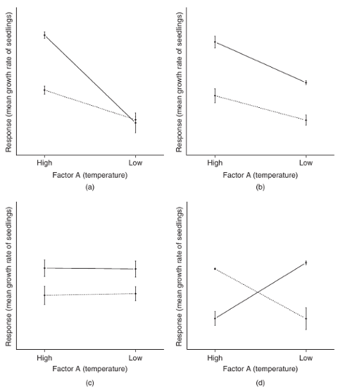
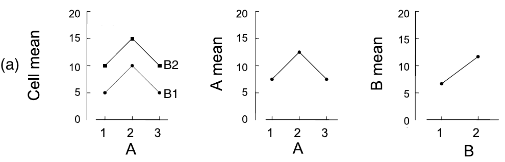
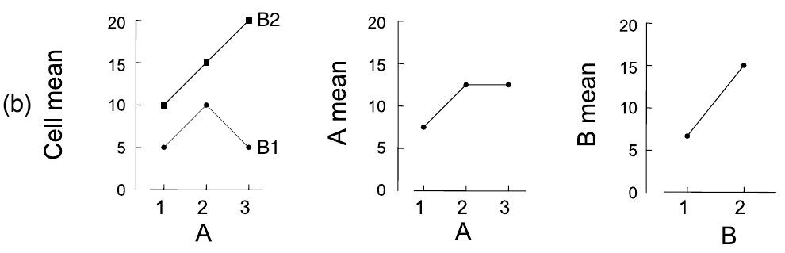
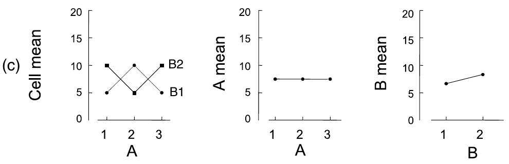

## Многофакторный дисперсионный анализ

- Модель многофакторного дисперсионного анализа
- Взаимодействие факторов
- Несбалансированные данные, типы сумм квадратов
- Многофакторный дисперсионный анализ в R

### Вы сможете

- Проводить многофакторный дисперсионный анализ и интерпретироваот его результаты с учетом взаимодействия факторов

```{r setup, include = FALSE, cache = FALSE}
#-------
# RUN THE FRAGMENT BETWEEN LINES BEFORE COMPILING MARKDOWN
# to configure markdown parsing
options(markdown.extensions = c("no_intra_emphasis", "tables", "fenced_code", "autolink", "strikethrough", "lax_spacing", "space_headers", "latex_math"))
#-----
options(width = 80, scipen = 6, digits = 3)
# to render cyrillics in plots use cairo pdf
options(device = function(file, width = 6, height = 6, ...) {
  cairo_pdf(tempfile(), width = width, height = height, ...)
  })
# chunk default options
library(knitr)
opts_chunk$set(fig.align='center', fig.width = 10, fig.height = 5, comment = "#", cache = F)  
# this allows for code formatting inline
knit_hooks$set(inline = function(x) {
   if (is.numeric(x)) return(knitr:::format_sci(x, 'latex'))
   x = as.character(x)
   h = knitr:::hilight_source(x, 'latex', list(prompt = FALSE, 
                                               size='normalsize', 
                                               highlight = FALSE))
   h = gsub("([_#$%&])", "\\\\\\1", h)
   h = gsub('(["\'])', '\\1{}', h)
   gsub('^\\\\begin\\{alltt\\}\\s*|\\\\end\\{alltt\\}\\s*$', '', h)})
```

--- .segue

# Модель многофакторного дисперсионного анализа

---

## Линейные модели для факторных дисперсионных анализов

- Два фактора A и B, двухфакторное взаимодействие

$y _{ijk} = \mu + \alpha _i + \beta _j + (\alpha \beta) _{ij} + \epsilon _{ijk}$

<br /><br />

- Три фактора A, B и C, двухфакторные взаимодействия, трехфакторное взаимодействия

$y _{ijkl} = \mu + \alpha _i + \beta _j + \gamma _k + (\alpha \beta) _{ij} + (\alpha \gamma) _{ik} + (\beta \gamma) _{jk} + (\alpha \beta \gamma) _{ijk} + \epsilon _{ijkl}$

--- .segue

# Взаимодействие факторов

--- &twocol

## Взаимодействие факторов

Эффект фактора B разный в зависимости от уровней фактора A и наоборот

*** =left

На каких рисунках есть взаимодействие факторов?

>- b, c - нет взаимодействия 
- a, d - есть взаимодействие

*** =right



<div class = "footnote">Рисунок из Logan, 2010, fig.12.2</div>

---

## Влияют ли главные эффекты и взаимодействие?



> - взаимодействие достоверно, и не маскирует главные эффекты
- фактор А влияет
- фактор В влияет

<div class = "footnote">Рисунок из Quinn, Keough, 2002, fig.9.3</div>

---

## Влияют ли главные эффекты и взаимодействие?


> - взаимодействие достоверно и мешает интерпретировать влияние факторов отдельно:
    - для В2 зависимая переменная возрастает с изменением уровня А
    - для В1 зависимая переменная возрастает только на А2, но не различается на А1 и А3
> - если смотреть на главные эффекты, можно сделать неправильные выводы:
    - фактор А влияет, группы А2 и А3 не отличаются
    - фактор В влияет, в группе В2 зависимая переменная больше, чем в В1

<div class = "footnote">Рисунок из Quinn, Keough, 2002, fig.9.3</div>

---

## Влияют ли главные эффекты и взаимодействие?



> - взаимодействие достоверно и мешает интерпретировать влияние факторов отдельно:
    - А1В2, А3В2 и А2В1 не различаются, значение зависимой переменной в этих группах выше, чем в остальных
    - А1В1, А3В1 и А2В2 не различаются
> - если смотреть на главные эффекты, можно сделать неправильные выводы:
    - факторы А и В не влияют

<div class = "footnote">Рисунок из Quinn, Keough, 2002, fig.9.3</div>

--- &twocol

## Взаимодействие факторов может маскировать главные эффекты

*** =left

- Если есть значимое взаимодействие
  - главные эффекты обсуждать не имеет смысла  
  - пост хок тесты проводятся только для ваимодействия

*** =right


<div class = "footnote">Рисунок из Quinn, Keough, 2002, fig.9.3</div>

---

## Задаем модель со взаимодействием в R

Взаимодействие обозначается `:` двоеточием

Если есть факторы A и B, то их взаимодействие A:B

Для такой модели $y _{ijk} = \mu + \alpha _i + \beta _j + (\alpha \beta) _{ij} + \epsilon _{ijk}$

### Полная запись

Y ~ A + B + A:B

### Сокращенная запись

обозначает, что модель включает все главные эффекты и их взаимодействия

Y ~ A*B

--- .segue

# Несбалансированные данные, типы сумм квадратов

--- &twocol

## Несбалансированные данные - когда численности в группах по факторам различаются

*** =left

Например так,

|    | A1 | A2 | A3 |
|----|----|----|----|
| B1 |  5 | 5  |  5 |
| B2 |  5 | 4  |  5 |

*** =right

или так,

|    | A1 | A2 | A3 |
|----|----|----|----|
| B1 |  3 | 8  |  4 |
| B2 |  4 | 7  |  4 |

---

## Проблемы несбалансированных дизайнов

> - Оценки средних в разных группах с разным уровнем точности (Underwood 1997)
- ANOVA менее устойчив к отклонениям от условий применимости (особенно от гомогенности дисперсий) при разных размерах групп (Quinn Keough 2002, section 8.3)
- Проблемы с рассчетом мощности. Если $\sigma _{\epsilon}^2 > 0$ и размеры выборок разные, то $MS _{groups} \over MS _{residuals}$ не следует F-распределению (Searle et al. 1992).

<br />
> - Cтарайтесь _планировать_ группы равной численности!
> - Но если не получилось - не страшно:
    - Для фикс. эффектов неравные размеры - проблема только если значения p близки к $\alpha$

---

## Типы сумм квадратов для несбалансированных данных

SSe и SSab - также как для сбалансированных данных, SSa и SSb - иначе

Типы сумм квадратов | I тип | II тип | III тип
------- | ------- | -------- | -------
Название | Последовательная | Без учета взаимодействий высоких порядков | Иерархическая
SS | SS(A),</br>SS(B &#8739; A)</br>SS(AB &#8739; B, A) | SS(A &#8739; B)</br>SS(B &#8739; A)</br>SS(AB &#8739; B, A) | SS(A &#8739; B, AB)</br>SS(B &#8739; A, AB)</br>SS(AB &#8739; B, A)
Величина эффекта зависит от выборки в группе | Да | Да | Нет
Результат зависит от порядка включения факторов в модель | Да | Нет | Нет
Результат зависит от параметризации | Нет | Нет | Да (только параметризация эффектов `contr.sum`, или Хельмерта `contr.helmert`)
Команда R | `aov()` | `Anova()` (пакет `car`) | `Anova()` (пакет `car`) 

>- Для сбалансированных дизайнов - результаты одинаковы
>- Для несбалансированных дизайнов рекомендуют __суммы квадратов III типа__ если есть взаимодействие факторов (Maxwell & Delaney 1990, Milliken, Johnson 1984, Searle 1993, Yandell 1997)

--- .segue

# Многофакторный дисперсионный анализ в R

--- &twocol

## Пример: Возраст и память

Почему пожилые не так хорошо запоминают? Может быть не так тщательно перерабатывают информацию? (Eysenck, 1974)

*** =left

Факторы:
- `Age` - Возраст:
  - `Younger` - 50 молодых
  - `Older` - 50 пожилых (55-65 лет)
- `Process` - тип активности:
  - `Counting` - посчитать число букв
  - `Rhyming` - придумать рифму к слову
  - `Adjective` - придумать прилагательное
  - `Imagery` - представить образ
  - `Intentional` - запомнить слово

Зависимая переменная - `Words` - сколько вспомнили слов

<div class = "footnote">http://www.statsci.org/data/general/eysenck.html</div>

*** =right

```{r, message = FALSE}
memory <- read.delim(file="eysenck.csv")
head(memory, 10)
```

---

##   Посмотрим на боксплот

```{r, fig.height = 5}
library(ggplot2)
theme_set(theme_bw(base_size = 18) + theme(legend.key = element_blank()))
ggplot(data = memory, aes(x = Age, y = Words)) + 
  geom_boxplot(aes(fill = Process))
```

> - Некрасивый порядок уровней memory$Process

---

## Боксплот с правильным порядком уровней

переставляем порядок уровней в порядке следования средних значений `memory$Words`

```{r}
memory$Process <- reorder(memory$Process, memory$Words, FUN=mean)
mem_p <- ggplot(data = memory, aes(x = Age, y = Words)) + 
  geom_boxplot(aes(fill = Process))
mem_p
```

---

## Таблица результатов многофакторного дисперсионного анализа

Внимание: при использовании III типа сумм квадратов, нужно __обязательно указывать тип контрастов для факторов__. В данном случае - `contrasts=list(Age=contr.sum, Process=contr.sum)`

```{r}
memory_fit <- lm(formula = Words ~ Age * Process, data = memory, 
                 contrasts=list(Age=contr.sum, Process=contr.sum))
```

--- .prompt

## Задание: Проверьте условия применимости дисперсионного анализа

- Есть ли гомогенность дисперсий?
- Не видно ли трендов в остатках?
- Нормальное ли у остатков распределение?

---

## Решение: 1. Проверяем условия применимости

- Есть ли гомогенность дисперсий?
- Не видно ли трендов в остатках?

```{r warning=FALSE}
library(car)
residualPlots(memory_fit)
```

---

## Решение: 2. Проверяем условия применимости

- Нормальное ли у остатков распределение?

```{r}
qqPlot(memory_fit)
```

--- &twocol

## Результаты дисперсионного анализа

*** =left

```{r, R.options=list(width = 45)}
Anova(memory_fit, type = 3)
```

>- Поскольку взаимодействие достоверно, факторы отдельно можно не тестировать. Проведем пост хок тест по взаимодействию, чтобы выяснить, какие именно группы различаются

*** =right

```{r, echo=FALSE, fig.width=6, fig.height=7}
mem_p + guides(fill=guide_legend(ncol=3)) + theme(legend.position = "bottom") 
```


---

## Пост хок тест

```{r}
# создаем переменную-взаимодействие 
memory$AgeProc <- interaction(memory$Age, memory$Process)
# подбираем модель без intercept 
mod <- lm(Words ~ AgeProc - 1, data = memory)
library(multcomp)
memory_tukey <- glht(mod, linfct = mcp(AgeProc = "Tukey"))
options(width = 90)
summary(memory_tukey)
```

---

## Данные для графиков

```{r, message = FALSE}
library(dplyr)
memory_summary <- memory %>% 
  group_by(Age, Process) %>% 
  summarise(.mean = mean(Words),
            .sd = sd(Words))
```

---

## Графики для результатов: Столбчатый график

```{r message = FALSE}
mem_barp <- ggplot(data = memory_summary, 
                   aes(x = Age, y = .mean, ymin = .mean - .sd, 
                       ymax = .mean + .sd, fill = Process)) + 
  geom_bar(stat = "identity", position = "dodge") + 
  geom_errorbar(width = 0.3, position = position_dodge(width = 0.9))
mem_barp
```

---

## Графики для результатов: Линии с точками

```{r}
pos <- position_dodge(width = 0.9)
mem_linep <- ggplot(data = memory_summary, 
                    aes(x = Age, y = .mean, ymin = .mean - .sd, 
                        ymax = .mean + .sd, colour = Process, 
                        group = Process)) + 
  geom_point(size = 3, position = pos) +
  geom_line(position = pos) +
  geom_errorbar(width = 0.3, position = pos) 
mem_linep
```

---

## Какой график лучше выбрать?

```{r message = FALSE, fig.width = 11, fig.height = 6}
library(gridExtra)
grid.arrange(mem_barp, mem_linep, ncol = 2)
```

>- Должен быть максимум данных в минимуме чернил (Tufte, 1983)

---

## Приводим понравившийся график в приличный вид

```{r, message=FALSE}
mem_linep <- mem_linep + labs(x = "Возраст",  y = "Число запомненных слов") + 
  scale_x_discrete(labels = c("Пожилые", "Молодые")) + 
  scale_colour_brewer(name = "Процесс", palette = "Dark2", 
                      labels = c("Счет", "Рифма", "Прилагательное",
                                 "Образ", "Запоминание")) + 
  theme(legend.key = element_blank())
mem_linep
```

---

## Take home messages

- Многофакторный дисперсионный анализ позволяет оценить взаимодействие факторов. Если оно значимо, то лучше воздержаться от интерпретации их индивидуальных эффектов
- Если численности групп равны - получаются одинаковые результаты с использованием I, II, III типы сумм квадратов
- В случае, если численности групп неравны (несбалансированные данные) по разному тестируется значимость факторов (I, II, III типы сумм квадратов)

---

## Дополнительные ресурсы

- Quinn, Keough, 2002, pp. 221-250
- Logan, 2010, pp. 313-359
- Sokal, Rohlf, 1995, pp. 321-362
- Zar, 2010, pp. 246-266
