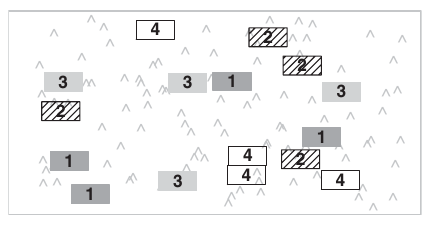

## Модели со случайными факторами

- Фиксированные и случайные факторы
- Смешанные модели
- Типы данных, для которых нужны смешанные модели
- Как устроена смешанная линейная модель?
- Оценка параметров смешанных линейных моделей

### Вы сможете

- Рассказать чем фиксированные факторы отличаются от случайных
- Привести примеры факторов, которые могут быть фиксированными или случайными в зависимости от задачи исследования
- Привести примеры планов экспериментов со случайными факторами
- Рассказать, что оценивает коэффициент внутриклассовой корреляции и вычислить его для  случая с одним случайным фактором
- Подобрать смешанную линейную модель в R при помощи методов максимального правдоподобия

--- .segue

# Фиксированные и случайные факторы

--- &twocol

#

*** =left

В дисперсионном анализе, как его придумал Фишер, не делалось различий между разными типами факторов

- факторы влияют на различия внутригрупповых средних

*** =right

Черчилль Эйзенхарт (1947) первый заметил различие между фиксированными и случайными факторами.

- __фиксированные эффекты__ - влияют на различия внутригрупповых средних $y$
- __случайные эффекты__ - влияют на различия внутригрупповых дисперсий $y$

--- &twocol

## Фиксированные и случайные факторы

*** =left

### Фиксированные факторы

- Одна страна по сравнению с другой

- Пол

- Добавили удобрение или нет

- Низина или вершина

- Илистый или песчаный грунт

- Тень или свет

- Один возраст по сравнению с другим

*** =right

### Случайные факторы

- Выводок

- Блок на участке литорали

- Делянка на участке

- Особь с повторными измерениями

- Аквариум в лабораторном эксперименте

--- &twocol

## Фиксированные и случайные факторы

*** =left

### Фиксированные факторы

- Градации фактора - фиксированные, заранее определенные и потенциально воспроизводимые уровни этого фактора (даже если и не все).

- Используются для тестирования гипотез о том, что средние значения зависимой переменной различаются в группах по фактору

$$H _{0}: μ _1 = μ _2 = · · · = μ _i = μ$$

- Выводы можно экстраполировать только на такие уровни, которые были задействованы в анализе

*** =right

### Случайные факторы

- Градации фактора - случайная выборка из возможных уровней этого фактора, повторить такой же набор градаций невозможно.

- Используются для тестирования гипотез о том, что с группировкой по фактору связана некоторая доля общей дисперсии

$$H _{0}:  σ _α^2 = 0$$

- Выводы можно экстраполировать на все возможные уровни фактора

---

## Какого типа эти факторы? От чего это зависит?

- Несколько произвольно выбранных градаций плотности моллюсков в полевом эксперименте, где плотностью манипулировали.

- Фактор размер червяка (маленький, средний, большой) в выборке червей.

- Деление губы Чупа на зоны с разной степенью распреснения.

 

>- Может ли один и тот же фактор рассматриваться как случайный или фиксированный?

>- Приведите примеры, как тип фактора будет зависеть от проверяемых гипотез

--- .segue

# Смешанные модели - содержат фиксированные и случайные факторы одновременно

---

## Псевдорепликация - нарушение независимости наблюдений

- Если есть временной ряд наблюдений
- Если пробы расположены рядом
- Если пробы/измерения взяты с одного объекта

Если такие данные проанализировать, как будто все наблюдения независимы, произойдет псевдорепликация

Можно усреднить значения между псевдоповторностями, а можно применить смешанные модели

### Типы данных, для которых нужны смешанные модели

- blocking designs
- nested
- repeated measures & longitudinal data

---

## Полностью рандомизированный план (completely-randomised)

Для этого варианта не нужны смешанные модели

Экспериментальные единицы распределены по тритментам полностью случайно.

Нет псевдорепликации

--- &twocol

## Случайный блочный план (complete block design)

*** =left

полностью рандомизированный план

*** =right

случайный блочный план

Экспериментальные единицы объединены в блоки. И внутри блоков случайным образом распределены по тритментам

Наблюдения внутри одного блока похожи

--- &twocol

## Вложенный план (nested design)

*** =left

Полностью рандомизированный план

*** =right

Вложенный план

Группы экспериментальных единиц случайно распределены по тритментам. Внутри группы сделано несколько измерений.

--- &twocol

## Повторные измерения в пространстве и во времени

*** =left

План с повторными измерениями в пространстве

Внутри каждого блока в пространстве делается несколько измерений

*** =right

План с повторными измерениями во времени

На каждом субъекте делается несколько измерений

--- &twocol

## Планы с ращепленными делянками и сложный план с повторными измерениями

*** =left

План с ращепленными делянками

Блоки распределены по группам фактора А, внути блока единицы случайным образом распределены по группам фактора Б

*** =right

План с повторными измерениями

Субъекты (единицы) случайным образом распределены по тритментам, на каждом субъекте делается несколько измерений

---

## Структура ковариаций при различных эксп. планах

---

# Как устроена смешанная линейная модель?

---

## Пример: Видовое богатство на разных участках в зависимости от высоты на литорали

---

## Смешанная линейная модель

$$Y_i = X _i \times \beta + Z_i \times b _i + \epsilon _i$$

$b _i \sim N(0, D)$ - случайные эффекты нормально распределены со средним 0 и дисперсией D

$\epsilon _i \sim N(0, \Sigma _i)$ - остатки модели нормально распределены со средним 0 и дисперсией $\Sigma _i$

$X _i \times \beta$ - фиксированная часть модели

$Z_i \times a _i$ - случайная часть модели

---

## В примере модель можно записать так:

$$R _{ij} = \beta _0 + \beta _1 \times Beach _i + \beta _2 \times NAP _{ij} + \epsilon _i$$

в матричном виде это записываеться:

$$ \left( \begin{array}{c} R _{i1} \\ R _{i2} \\ R _{i3} \\ R _{i4} \\ R _{i5} \end{array} \right)
= \left(\begin{array}{cc}
1 & NAP _{i1} \\ 1 & NAP _{i2}\\ 1 & NAP _{i3}\\ 1 & NAP _{i4}\\ 1 & NAP _{i5}
\end{array} \right)
\times
\left( \begin{array}{c}
\beta _0 \\ \beta _1
\end{array} \right) + 
\left( \begin{array}{c} 1 \\ 1 \\ 1 \\ 1 \\ 1 \end{array} \right)
\times b _{i} + 
\left( \begin{array}{c} \epsilon _{i1} \\ \epsilon _{i2}\\ \epsilon _{i3}\\ \epsilon _{i4}\\ \epsilon _{i5} \end{array} \right)$$

что можно записать сокращенно так:

$$R _i = X _i \times \beta + Z _i \times b _i$$

---

## Теперь разберемся с допущениями

$b _i \sim N(0, d^2)$ - случайные эффекты $b _i$ нормально распределены со средним 0 и дисперсией $d^2$

$\epsilon _i \sim N(0, \Sigma _i)$ - остатки модели нормально распределены со средним 0 и матрицей ковариаций $\Sigma _i$

Матрица ковариаций остатков выглядит так:
$$\Sigma _i = \sigma^2 \times 
\left( \begin{array}{ccccc}
1 & 0 & \cdots & \cdots & 0 \\
0 & 1 & 0 & \cdots & \vdots \\
\vdots & 0 & 1 & 0 & \vdots \\
\vdots & \vdots & 0 & 1 & 0 \\
0 & \cdots & \cdots & 0 & 1
\end{array} \right)$$

Т.е. остатки независимы друг от друга (вне диагонали стоят нули, т.е. ковариация разных остатков 0).

В то же время, отдельные значения $Y_i$ уже не будут независимы друг от друга при добавлении случайных эффектов - см. ниже

---

Можно показать, что $Y _i$ нормально распределена $Y _i \sim N(X _i \times \beta, V _i)$

$V _i = Z _i × D × Z' _i + \Sigma _i$ - матрица ковариаций зависимой переменной

$D$ - матрица ковариаций случайных эффектов.

Т.е. __добавление случайных эффектов приводит к изменению ковариационной матрицы__ $V _i$

Для модели со случайным intercept:

$$
V _i =  \left( \begin{array}{c} 1 \\ 1 \\ 1 \\ 1 \\ 1 \end{array}\right)
\times d^2
\times \left( \begin{array}{c} 1 & 1 & 1 & 1 & 1 \end{array}\right) +
\sigma^2
\times
\left( \begin{array}{ccccc}
1 & 0 & \cdots & \cdots & 0 \\
0 & 1 & 0 & \cdots & \vdots \\
\vdots & 0 & 1 & 0 & \vdots \\
\vdots & \vdots & 0 & 1 & 0 \\
0 & \cdots & \cdots & 0 & 1
\end{array} \right) = $$
$$
= \left( \begin{array}{ccccc}
\sigma^2 + d^2 & d^2 & d^2 & d^2 & d^2 \\
d^2 & \sigma^2 + d^2 & d^2 & d^2 & d^2 \\
d^2 & d^2 & \sigma^2 + d^2 & d^2 & d^2 \\
d^2 & d^2 & d^2 & \sigma^2 + d^2 & d^2 \\
d^2 & d^2 & d^2 & d^2 & \sigma^2 + d^2
\end{array} \right)
$$

---

## Индуцированная корреляция - следствие  включения в модель случайных эффектов
$$ V_i =
\left( \begin{array}{ccccc}
\sigma^2 + d^2 & d^2 & d^2 & d^2 & d^2 \\
d^2 & \sigma^2 + d^2 & d^2 & d^2 & d^2 \\
d^2 & d^2 & \sigma^2 + d^2 & d^2 & d^2 \\
d^2 & d^2 & d^2 & \sigma^2 + d^2 & d^2 \\
d^2 & d^2 & d^2 & d^2 & \sigma^2 + d^2
\end{array} \right)
$$

$d^2$ - ковариация между пробами с одного пляжа; $\sigma^2 + d^2$ - дисперсия

Т.е. корреляция между пробами с одного пляжа будет $d^2 / (\sigma^2 + d^2)$

### Коэффициент внутриклассовой корреляции $d^2 / (\sigma^2 + d^2)$

Способ измерить, насколько коррелируют друг с другом наблюдения из одной и той же группы случайного фактора

Следствие: Если он высок, то можно брать меньше проб в группе (и больше групп, если нужно)

---

## Структура ковариаций при различных эксп. планах

--- .segue

# Оценка параметров смешанных линейных моделей

---

## Оценка параметров методом максимального правдоподобия

  - Метод максимального правдоподобия (maximum likelihood, ML)
  - Метод ограниченного максимального правдоподобия (restricted maximum likelihood, ML)

- лучшие оценки параметров
- возможность работать с несбалансированными группами
- моделируют внутригрупповую структуру корреляций (сходство наблюдений внутри групп по случайному фактору)
- можно получить доверительные интервалы параметров (интервалы, в которых окажется значение параметра при анализе похожих данных в p% случаев)

---

## Байесовские методы оценки параметров

  - Марковские цепи Монте Карло (Markov chain Monte Carlo, MCMC)

- Марковские цепи позволяют получить апостериорные распределения параметров
- Выборки из этих распределений можно использовать для построения p% байесовских доверительных интервалов (интервалы, в которых с p% вероятностью находится истинное значение параметра)

--- &twocol

## Синтаксис задания моделей в R

__Фиксированная часть модели__ задается двухсторонней формулой

`fixed = y ~ 1`

__Случайная часть модели__ - односторонняя формула. До вертикальной черты - случайный угол наклона, после вертикальной черты - случайный intercept.

Вложенные друг в друга эффекты указываются от крупного к мелкому через "/" 

`random = ~ 1|a/b/c`

__Два пакета в r__, каждый со своим синтаксисом

*** =left

- `lme()` из пакета `nlme`

`lme(fixed = y ~ 1, random = ~ 1|a/b/c)`

*** =right

- `lmer()` из пакета `lme4`

`lmer(y ~ 1 + (1|a/b/c))`, если уровни вложенных факторов повторяются в группах более крупных факторов

`lmer(y ~ 1 + (1|a) + (1|b) + (1|c))`, если уровни вложенных факторов имеют уникальные названия

---

## Take home messages

- Смешанные модели включают случайные и фиксированные факторы
- Градации фиксированных факторов заранее определены, а выводы можно экстраполировать только на такие уровни, которые были задействованы в анализе. Тестируется гипотеза о значении средних
- Градации случайных факторов - выборка из возможных уровней, а выводы можно экстраполировать на другие уровни. Тестируется гипотеза о дисперсии между группами по фактору.
- Коэффициент внутриклассовой корреляции оценивает, насколько коррелируют друг с другом наблюдения из одной и той же группы случайного фактора
- Параметры смешанных моделей подбирают методами максимального правдоподобия или байесовскими методами.

---

## Дополнительные ресурсы

- Crawley, M.J. (2007). The R Book (Wiley).
- Zuur, A.F., Ieno, E.N., Walker, N., Saveliev, A.A., and Smith, G.M. (2009). Mixed Effects Models and Extensions in Ecology With R (Springer).
