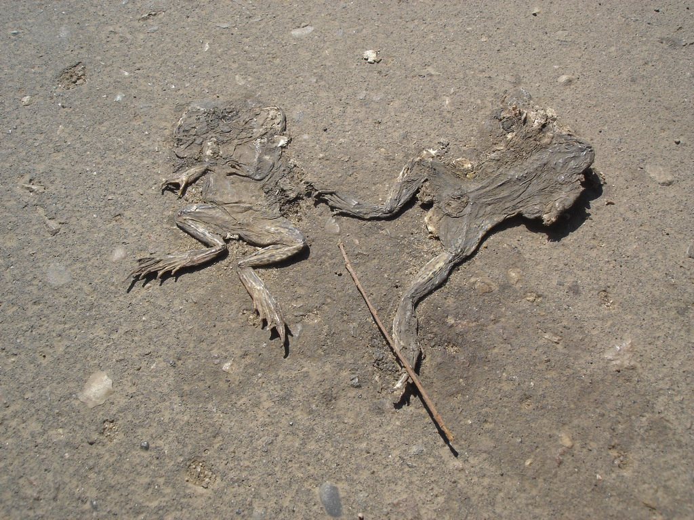
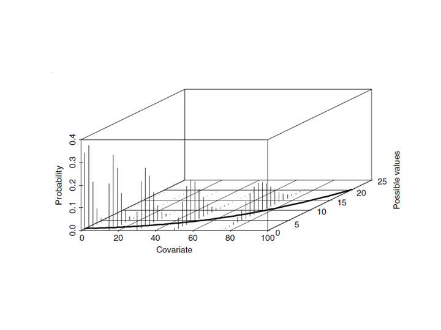
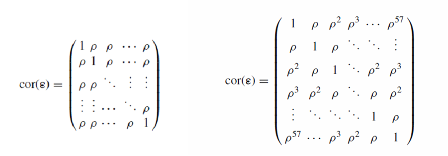

# Мы рассмотрим 
+ Различные варианты регрессионного анализа, применяющегося для тех случаев, когда зависимая перменная - счетная величина (целые положительные числа)
+ Технику, лежащую в основе обобщенных аддитивных моделей
+ Некоторые аспекты обобщенных смешанных аддитивных моделей 

# Вы сможете
+ Построить пуасоновскую и квазипуассоновскую регрессионную модель
+ Объяснить проблемы, связанные с избыточностью дисперсии в модели
+ Построить модель, основанную на отрицаетльном биномиальном распределении
+ Построить аддитивную модель, основанную на пуассоновском и отрицательном биномиальном распределении
+ Построить смешанную аддитивную модель, учитывающую автокорреляцию остатков


```{r setup, include = FALSE, cache = FALSE, eval = -3}
#----------------------------------------------------------------
# RUN THE FRAGMENT BETWEEN LINES BEFORE COMPILING MARKDOWN
# to configure markdown parsing
options(markdown.extensions = 
          c("no_intra_emphasis",# skip markdown embedded in words
            "tables",           # create HTML tables
            "fenced_code",      # treat text as verbatim when surrounded with begin and ending lines with three ~ or ' characters.
            "autolink",         # create HTML links from urls and email addresses.
            "strikethrough",    # create strikethroughs by surrounding text with ~~.
            "lax_spacing",      # allow HTML tags inside paragraphs without being surrounded by newlines.
            "space_headers",    # add a space between header hashes and the header itself.
            "latex_math"))      # transforms all math equations into syntactically correct MathJax equations.
#--------------------------------------------------------------
# output options
options(width = 90, # set the maximum number of columns on a line
        scipen = 6, # fixed notation of floating point numbers, unless it is more than scipen digits wider, else - exponential notation
        digits = 4) # the number of digits to print when printing numeric values

# to render cyrillics in plots use cairo pdf
options(device = function(file, width = 7, height = 7, ...) {
  cairo_pdf(tempfile(), width = width, height = height, ...)
  })

# chunk default options
library(knitr)
opts_chunk$set(
#   fig.align='center',  # default figure alignment
               warnings = FALSE,
               message = FALSE,
               fig.width = 10,      # default figure width
               fig.height = 6)      # default figure height

# this allows for code formatting inline
knit_hooks$set(inline = function(x) {
   if (is.numeric(x)) return(knitr:::format_sci(x, 'latex'))
   x = as.character(x)
   h = knitr:::hilight_source(x, 'latex', list(prompt = FALSE, 
                                               size='normalsize', 
                                               highlight = FALSE))
   h = gsub("([_#$%&])", "\\\\\\1", h)
   h = gsub('(["\'])', '\\1{}', h)
   gsub('^\\\\begin\\{alltt\\}\\s*|\\\\end\\{alltt\\}\\s*$', '', h)})
```


---- &twocol

# Убийства на дорогах - от чего зависит количество задавленных амфибий? 

*** =left
Пример взят из книги Zuur et al. 2009  
На 500 метровых отрезках дороги учитывали останки задавленых амфибий.
Для каждого участка оценивали значения 17 параметров

Open lands (ha) OPEN.L  
Olive grooves (ha) OLIVE  
Montado with shrubs (ha) MONT.S  
Montado without shrubs (ha) MONT  
Policulture (ha) POLIC  
Shrubs (ha) SHRUB  
Urban (ha) URBAN  
Water reservoirs (ha) WAT.RES  
Length of water courses (km) L.WAT.C  
Dirty road length (m) L.D.ROAD  
Paved road length (km) L.P.ROAD  
Distance to water reservoirs D.WAT.RES  
Distance to water courses D.WAT.COUR  
Distance to Natural Park (m) D.PARK  

*** =right
   

Number of habitat Patches N.PATCH  
Edges perimeter P.EDGE  
Landscape Shannon diversity index L.SDI  

----

# Различные типы зависимых перменных и особенности их моделирования

Характер величин | Распределение | Связывающая функция (link function)   
|-------------|-------------|-------------|  
Непрерывные величины, потенциально варьирующие в пределах $-\infty , + \infty$ | Гауссовское (Нормальное) | identity  $X\beta = \mu$   
Бинарные величины (1; 0)  |  Биномиальное распределение  | logit $X\beta = ln(\frac{\mu}{1 - \mu})$    
Счетные величины (0, 1, 2, 3...)  |  Распределение Пуассона или Отрицательное биномиальное распределение  |log $X\beta = ln(\mu)$  


---- .segue  

# Пуассоновская регрессия

---- &twocol

# Распределение Пуассона (Poisson distribution)

*** =left
```{r, echo=FALSE, fig.width=7}
library(ggplot2)
theme_set(theme_bw(base_size = 16) +
            theme(legend.key = element_blank()))
update_geom_defaults("point", list(shape = 19, size = 3))


pois_distr <- data.frame(draw = c(rpois(500, lambda=1), rpois(500, lambda=5), rpois(500, lambda=10), rpois(500, lambda=15)), mu = rep(c(1, 5, 10, 15), each=500))

ggplot(pois_distr, aes(x=draw)) + geom_histogram(bin=1, color="black", fill = "blue") + facet_wrap (~mu, ncol=1)

```


*** =right
Распределение имеет один единственный параметр $\mu$

$$p(y) = \frac{\mu^y}{y!}e^{-\mu}$$

при этом матожидание распределения Пуассона равно его дисперсии 

$$E(Y) = \mu$$
$$var(Y) = \mu$$

Чем больше среднее значение, тем больше варьирование 

----- &twocol

# Пуассоновская регрессия

*** =left
```{r, echo=FALSE, warning=FALSE, fig.width= 7}
kill <- read.table("RoadKills.txt", header=TRUE)

G <- predict(M2, newdata = NewData, type = "link", se.fit = TRUE)

NewData$pois_Pred  <- exp(G$fit) 
NewData$pois_SEUP <- exp(G$fit + 1.96*G$se.fit) 
NewData$pois_SELOW <- exp(G$fit - 1.96*G$se.fit)

Points <- data.frame(D.PARK = rep(kill$D.PARK, each=100), Pred = rep(fitted(M2), each=100))


for (i in 1:nrow(Points)){Points$draw[i] <- rpois(100, lambda = Points$Pred[i])}

ggplot(NewData, aes(x =  D.PARK , y = pois_Pred))  + geom_point(data = kill, aes(x=D.PARK, y=TOT.N), size=4, color="blue4") + geom_hline(yintercept=0) + geom_point(data = Points, aes(x=D.PARK, y=draw), size=0.5, position = position_jitter(width = 50) ) + geom_line(size=2, color="red")  + ylab("Draws from Poisson distributions")

```

*** =right

  из кн. Zuur et al.2009    
   

----

# Остатки в обобщенных линейных моделях

Обычные остатки (response residuals)

$$y_i - \mu_i$$


Пирсоновские остатки (Pearson residuals)
$$\frac{y_i - \mu_i}{\sqrt{\mu_i}}$$

----  

# Избыточная дисперсия (Overdipersion)

В Пуассоновской регрессии мы моделируем изменене распределения Пуассона в зависимости от каких-то предикторов.

В распределении Пуассона $E(Y) = \mu$ и $var(Y) = \mu$

Если в имеющихся данных $var(Y) > \mu$,  то нарушается условие применимости пуассоновской регрессии. 


---- .segue

# Квази-пуассоновские модели

----

Отличие от пуассоновсой регрессии заключается лишь в том, что в квази-пуассоновских моделях вводится поправка для связи дисперси и матожидания. 
<br>
<br>

В этой модели матожидание $E(Y) = \mu$ и дисперсия $var(Y) =  \phi \times \mu$

<br>
<br>

Величина $\phi$ показывает во сколько раз дисперсия превышает матожидание.

$$\phi =  \frac{var(Y)}{\mu}=\frac {\frac{\sum{(\epsilon_i)^2}}{N - p}}  {\mu} =  \frac{\sum{(\epsilon_{pearson})^2}}{N - p}$$

>- Модель, по сути, остается той же, что и пуассоновская, но изменяются стандартные ошибки оценок параметров они домножаются на $\sqrt{\phi}$

---- .segue

# Отрицательное биномиальное распределение (Negative binomial distribution)


----

# Отрицательное биномиальное распределение (Negative binomial distribution)

$$ p(y) = \frac{\Gamma(y+k)}{\Gamma(k) \times \Gamma(y+1)} \times (\frac{k}{\mu + k})^k \times (1- \frac{k}{\mu + k})^y $$

В этой формуле $\Gamma(y) = (y-1)!$

Распределение имеет два параметра $\mu$ и $k$. При этом, матожидание в этом распределении $E(Y) = \mu$, а дисперсия $var(Y) = \mu + \frac{\mu^2}{k}$  

Параметр $k$ называют параметром дисперсии (dispersion parameter)   

Если $k >> \mu$, то распределение сводится к распределению Пуассона

----- .segue

# Нелинейные связи (Generalised Additive Models)

---

### При моделировании линейных связей, задача  - подобрать вектор коэффициентов регрессии

$$ Y_i = \beta_0 + \beta_1X_i + \epsilon_i$$

### При моделировании нелинейных связей, задача  - подобрать параметры сглаживающей функции

$$ Y_i = \beta_0 + f(X_i) + \epsilon_i$$


----

На самом деле нет единой сглаживающей функции - регрессионная кривая - это набор локальных регрессий.

Простейший алгоритм - LOESS (LOcal rEgreSsion Smoother)

```{r, echo=FALSE}
ggplot(data = kill, aes(x=D.PARK, y=TOT.N)) + geom_point() + geom_smooth(type = "loess") 

```

----

В пакете `mgcv` используется более сложный алгоритм для подбора сглаживающей функции

$$ Y_i = \beta_0 + f(X_i) + \epsilon_i$$

Сглаживающая функция подбирется с помощью сплайнов

$$f(X_i) = \beta_1 + \beta_2X_i + \beta_3(X_i)^2 + \beta_4(X_i)^3$$

Для каждого локального отрезка подбирается такой сплайн, который наилучшим сособом вписывается в данные.  

Чем больше сплайнов, тем сложнее модель


---- .segue

# Модели с автокорреляцией остатков

---- &twocol

# Функция автокорреляции

*** =left
Сдвигаем данные относительно самих себя на определенный шаг (лаг)

```{r, echo=FALSE, fig.width=7}
library(gridExtra)
set.seed(12345)
x <- seq(1, 20)

dat <- data.frame(x = x, y= (sin(x) + rnorm(20, 0, 0.5)+10))

a <- ggplot(dat, aes(x=x, y=y)) + geom_line()
b <-  ggplot(dat, aes(x=x, y=y)) + geom_line() + geom_line(data = data.frame(x1=dat$x[2:20], y1=dat$y[1:19]), aes(x=x1, y=y1), color="blue")

grid.arrange(a, b)
```

*** =right

Для каждого лага вычисляется коэффициент корреляции между исходным рядом и рядом, сдвинутым на данный лаг  
<br>
<br>

Значения автокорреляционной функции варьируют в пределах [-1, 1]   

Коэффициент r>0 означает совпадение фаз рядов  
Коэффициент r<0 означает, что ряды находятся в противофазе  


----

### После серии сдвигов получаем кривую, которая описывает структуру временного (или пространственого) ряда

```{r}
acf(dat$y)
```

----

При построении модели мы исходим из предположения о независимости отстатков 

$$ \epsilon_s \sim N(0, \sigma^2)$$

если $s = t$
$$cov(\epsilon_s, \epsilon_t) = \sigma^2$$

если $s \ne t$
$$cov(\epsilon_s, \epsilon_t) = 0$$


Остатки из разных временых или пространственных точек не имеют ковариации

-----

В случае нличия корреляции между остаткми мы моделируем связь между ними, подбирая такую корреляционную функцию, которая связывала бы эти остатки  

если $s = t$
$$cor(\epsilon_s, \epsilon_t) = 1$$

если $s \ne t$
$$cor(\epsilon_s, \epsilon_t) = h(\epsilon_s, \epsilon_t, \rho)$$

функция $h()$ устанавливает корреляционную структуру 

----

# Примеры самых простых корреляционных структур

1.Compound symmetry structure

2.Авторегрессивная структура первого порядка (Auto-regressive model of order 1, AR-1) 
 


```{r}
cs1 <- corCompSymm(form = ~ D.PARK)

cs2 <- corAR1(form = ~ D.PARK)
```
