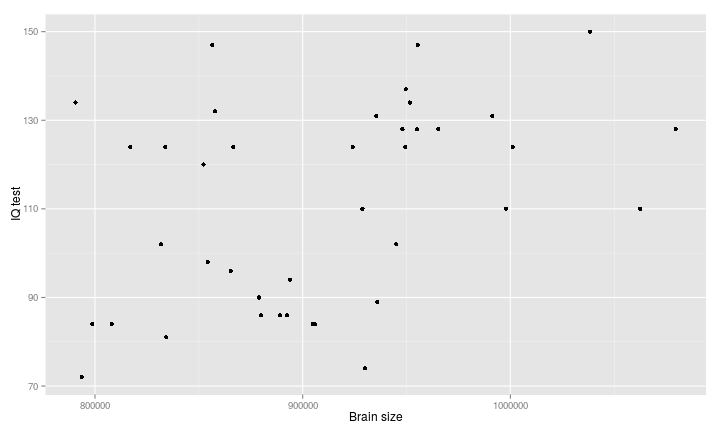

## Мы рассмотрим 
+ Базовые идеи корреляционного анализа
+ Проблему двух статистических подходов: "Тестирование гипотез vs. построение моделей"
+ Разнообразие статистических моделей
+ Основы регрессионного анализа

### Вы сможете
+ Оценить взаимосвязь между измеренными величинами
+ Объяснить что такое линейная модель
+ Формализовать запись модели в виде уравнения
+ Подобрать модель линейной регрессии
+ Проверить состоятельность модели при помощи t-критерия или F-критерия
+ Оценить предсказательную силу модели 


--- .segue

# Знакомимся с даными

---- &twocol

## Зависит ли уровень интеллекта от размера головного мозга?   

*** =left 

+ Было исследовано 20 девушек и 20 молодых людей (праворуких, англоговорящих, не склонных к алкоголизму, наркомании и прочим смещающим воздействиям)
+ У каждого индивида определяли биометрические параметры: вес, рост, размер головного мозга (количество пикселей на изображении ЯМР сканера)
+ Интеллект был протестирован с помощью IQ тестов


Пример взят из работы: Willerman, L., Schultz, R., Rutledge, J. N., and Bigler, E. (1991), "In Vivo Brain Size and Intelligence," Intelligence, 15, 223-228.  
Данные представлены в библиотеке *"The Data and Story Library"* 
http://lib.stat.cmu.edu/DASL/  

*** =right 

   

----

## Посмотрим на датасет   


```r
brain <- read.csv("IQ_brain.csv", header = TRUE)
head(brain)
```

```
##   Gender FSIQ VIQ PIQ Weight Height MRINACount
## 1 Female  133 132 124    118   64.5     816932
## 2   Male  140 150 124     NA   72.5    1001121
## 3   Male  139 123 150    143   73.3    1038437
## 4   Male  133 129 128    172   68.8     965353
## 5 Female  137 132 134    147   65.0     951545
## 6 Female   99  90 110    146   69.0     928799
```


---   

## Вспомним: _Сила и направление связи между величинами_   


--- .segue

# Основы корреляционного анализа

---

## Коэффициенты корреляции и условия их применимости   

Коэффициент | Фукция | Особенности примененения
|-------------|--------------------------------|-------------|
Коэф. Пирсона | `cor(x,y,method="pearson")` | Оценивает связь двух нормально распределенных величин. Выявляет только лиейную составляющую взамосвязи.
Ранговые коэффициенты (коэф. Спирмена, Кэндалла) | `cor(x,y,method="spirman")`<br>`cor(x,y,method="kendall")`   | Не зависят от формы распределения. Могут оценивать связь для любых монотонных зависимостей. 

---

## Оценка достоверности коэффициентов корреляции

>- Коэффициент корреляции - это статистика, значение которой описывает степень взаимосвязи двух сопряженных переменных. Следовательно применима логика статистического критерия. 
>- Нулевая гипотеза $H_0: r=0$
>- Бывают двусторонние $H_a: r\ne 0$ и односторонние критерии $H_a: r>0$ или $H_a: r<0$
>- Ошибка коэффициента Пирсона: $SE_r=\sqrt{\frac{1-r^2}{n-2}}$
>- Стандартизованная величина $t=\frac{r}{SE_r}$ подчиняется распределению Стьюдента с парметром $df = n-2$
>- Для ранговых коэффициентов существует проблема "совпадающих рангов" (tied ranks), что приводит к приблизительной оценке $r$ и приблизительной оценке уровня значимости. 
>- Достоверность коэффициента кореляции можно оценить пермутационным методом

--- .prompt

## Задание
+ Определите силу и направление связи между всеми парами исследованных признаков
+ Постройте точечную диаграмму, отражающую взаимосвязь между результатами IQ-теста (PIQ) и размером головного мозга (MRINACount)
+ Оцените достоверность значения коэффициента корреляции Пирсона между этими двумя перменными 

*Hint 1*: Обратите внимание на то, что в датафрейме есть пропущенные значения. Изучите, как работают c `NA` функуции, вычисляющие коэффициенты корреляции. 

*Hint 2* Для построения точечной диаграммы вам понадобится `geom_point()`

---

## Решение


```r
cor(brain[,2:6], 
    use = "pairwise.complete.obs")
```

```
##            FSIQ      VIQ       PIQ    Weight   Height
## FSIQ    1.00000  0.94664  0.934125 -0.051483 -0.08600
## VIQ     0.94664  1.00000  0.778135 -0.076088 -0.07107
## PIQ     0.93413  0.77814  1.000000  0.002512 -0.07672
## Weight -0.05148 -0.07609  0.002512  1.000000  0.69961
## Height -0.08600 -0.07107 -0.076723  0.699614  1.00000
```

```r
cor.test(brain$PIQ, 
         brain$MRINACount, 
         method = "pearson", 
         alternative = "two.sided")
```

```
## 
## 	Pearson's product-moment correlation
## 
## data:  brain$PIQ and brain$MRINACount
## t = 2.586, df = 38, p-value = 0.01367
## alternative hypothesis: true correlation is not equal to 0
## 95 percent confidence interval:
##  0.08563 0.62323
## sample estimates:
##    cor 
## 0.3868
```

---

## Решение


```r
pl_brain <- ggplot(brain, aes(x = MRINACount, y = PIQ)) + geom_point() + xlab("Brain size") + ylab("IQ test")
pl_brain
```



--- 

## Частные корреляции

Частная корреляция - описывает связь между двумя переменными при условии, что влияние других переменных удалено.

Мы удаляем из $X$ и $Y$ ту часть зависимости, которая вызвана влиянием $Z$   


```r
library(ppcor)
brain_complete <- brain[complete.cases(brain),]
pcor.test(brain_complete$PIQ, brain_complete$MRINACount, brain_complete$Height, )
```

```
##   estimate   p.value statistic  n gp  Method
## 1   0.5373 0.0001637     3.769 38  1 pearson
```

--- .segue 

# Два подхода к исследованию: Тестирование гипотезы и Построение модели

----

## Тестирование гипотезы VS построение модели 

+ Проведя корреляционный анализ, мы лишь ответили на вопрос "Существет ли достоверная связь между величинами?"

+ Сможем ли мы, используя это знание, _предсказть_ значения одной величины, исходя из знаний другой? 

---

## Тестирование гипотезы VS построение модели 

>- Простейший пример  

>- Между путем, пройденным автомобилем, и временем, проведенным в движении, несомнено есть связь. Хватает ли нам этого знания?   
>- Для расчета величины пути в зависимости от времени необходимо построить модель: $S=Vt$, где $S$ - зависимая величина, $t$ - независимая переменная, $V$ - параметр модели.
>- Зная параметр модели (скорость) и значение независимой переменной (время), мы можем рассчитать (*cмоделировать*) величину пройденного пути

--- .segue

# Какие бывают модели?

----

## Линейные и нелинейные модели

### Линейные модели 

$$y = b_0 + b_1x$$ <br> $$y = b_0 + b_1x_1 + b_2x_2$$ 

### Нелинейные модели 

$$y = b_0 + b_1^x$$ <br>  $$y = b_0^{b_1x_1+b_2x_2}$$ 

---

## Простые и многокомпонентные (множественные) модели

### Простая модель

$$y = b_0 + b_1x$$ 

### Множественная модель

$$y = b_0 + b_1x_1 + b_2x_2 + b_3x_3 + ... + b_nx_n$$ 

---- &twocol 

## Детерминистские и стохастические модели

*** =left

 

модель $у_i = 2 + 5x_i$
Два парметра: угловой коэффициент (slope) $b_1=5$; свободный член (intercept) $b_0=2$
Чему равен $y$ при $x=10$?

*** =right

 

модель $у = 2 + 5x + \epsilon$
Появляется дополнительный член $\epsilon_i$ 
Он вводит в модель влияние неучтенных моделью факторов. 
Обычно считают, что $\epsilon \in N(0, \sigma^2)$ 

---

## Модели с дискретными предикторами

 

Модель для данного примера имеет такой вид
$response = 4.6 + 5.3I_{Level2}$ + 9.9$I_{Level3}$

$I_{i}$ - dummy variable   

----

## Модель для зависимости величины IQ от размера головного мозга

Какая из линий "лучше" описывает облако точек?


"Essentially, all models are wrong, but some are useful"
(Georg E. P. Box) 

--- .segue

# Найти оптимальную модель позволяет регрессионный анализ


--- &twocol

## Происхождение термина "регрессия"

*** =left


Френсис Галтон (Francis Galton)


*** =right

"the Stature of the adult offspring … [is] … more mediocre than the
stature of their Parents" (цит. по `Legendre & Legendre, 1998`)

Рост _регрессирует_ (возвращается) к популяционной средней   
<br>
Угловой коэффициент в зависимости роста потомков от роста родителей- _коэффциент регресси_


---

## Подбор лиии регрессии проводится с помощью двух методов 

>- С помощью метода наименьших квадратов (Ordinary Least Squares) - используется для простых линейных моделей
<br>

>- Через подбор функции максимального правдоподобия (Maximum Likelihood) - используется для подгонки сложных линейных и нелинейных моделей.


---

## Кратко о методе макcимального правдоподобия 


<br>
(из кн. Zuur et al., 2009, стр. 19)  

--- &twocol

## Метод наименьших квадратов

*** =left

<br>
(из кн. Quinn, Keough, 2002, стр. 85)

*** =right

Остатки (Residuals): $e_i = y_i - \hat{y_i}$

Линия регрессии (подобраная модель) - это та линия, у которой $\sum{e_i}^2$ минимальна.

---

## Подбор модели методом наменьших квадратов с помощью функци `lm()`  
`fit <- lm(formula, data)`

Модель записывается в виде формулы  

Mодель | Формула
|-------------|-------------|  
Простая линейная регресся <br>$\hat{y_i}=b_0 + b_1x_i$ | `Y ~ X` <br> `Y ~ 1 + X` <br> `Y ~ X + 1`  
Простая линейная регрессия <br> (без $b_0$, "no intercept") <br> $\hat{y_i}=b_1x_i$ | `Y ~ -1 + X` <br> `Y ~ X - 1`  
Уменьшенная простая линейная регрессия <br> $\hat{y_i}=b_0$ | `Y ~ 1` <br> `Y ~ 1 - X`  
Множественная линейная регрессия <br> $\hat{y_i}=b_0 + b_1x_i +b_2x_2$ | `Y ~ X1 + X2`  


----

## Подбор модели методом наменьших квадратов с помощью функци `lm()` 

`fit <- lm(formula, data)`

Элементы формул для записи множественных моделей

Элемент формулы | Значение 
|-------------|-------------| 
`:` | Взаимодействие предикторов <br> `Y ~ X1 + X2 + X1:X2`
`*` | Обзначает полную схему взаимодействий <br>  `Y ~ X1 * X2 * X3` <br> аналогично <br> `Y ~ X1 + X2 + X3+ X1:X2 + X1:X3 + X2:X3 + X1:X2:X3` 
`.` | `Y ~ .` <br> В правой части формулы записываются все переменные из датафрейма, кроме `Y` 

----

## Подберем модель, наилучшим образом описывающую зависимость результатов IQ-теста от размера головного мозга


```r
brain_model <- lm(PIQ ~ MRINACount, data = brain)
brain_model
```

```
## 
## Call:
## lm(formula = PIQ ~ MRINACount, data = brain)
## 
## Coefficients:
## (Intercept)   MRINACount  
##     1.74376      0.00012
```

--- 

## Как трактовать значения параметров регрессионной модели?


----

## Как трактовать значения параметров регрессионной модели?

>- Угловой коэффициент (_slope_) показывает на сколько _единиц_ изменяется предсказанное значение $\hat{y}$ при изменении на _одну единицу_ значения предиктора ($x$)

>- Свободный член (_intercept_) - величина во многих случаях не имеющая "смысла", просто поправочный коэффициент, без которого нельзя вычислить $\hat{y}$. _NB!_ В некоторых линейных моделях он имеет смысл, например, значения $\hat{y}$ при $x = 0$. 

>- Остатки (_residuals_) - характеризуют влияние неучтенных моделью факторов.

--- .prompt

## Вопросы:

1. Чему равны угловой коэффициент и свободный член полученной модели `brain_model`?

2. Какое значеие IQ-теста предсказывает модель для человека с объемом  мозга равным 900000 

3. Чему равно значение остатка от модели для человека с порядковым номером 10 

----

## Ответы


```r
coefficients(brain_model) [1]
```

```
## (Intercept) 
##       1.744
```

```r
coefficients(brain_model) [2]
```

```
## MRINACount 
##  0.0001203
```

```r
coefficients(brain_model) [1] + coefficients(brain_model) [2] * 900000
```

```
## (Intercept) 
##         110
```

```r
brain$PIQ[10] - fitted(brain_model)[10]
```

```
##    10 
## 30.36
```

```r
residuals(brain_model)[10]
```

```
##    10 
## 30.36
```

----

## Углубляемся в анализ модели: функция `summary()`


```r
summary(brain_model)
```

```
## 
## Call:
## lm(formula = PIQ ~ MRINACount, data = brain)
## 
## Residuals:
##    Min     1Q Median     3Q    Max 
##  -39.6  -17.9   -1.6   17.0   42.3 
## 
## Coefficients:
##               Estimate Std. Error t value Pr(>|t|)  
## (Intercept)  1.7437570 42.3923825    0.04    0.967  
## MRINACount   0.0001203  0.0000465    2.59    0.014 *
## ---
## Signif. codes:  0 '***' 0.001 '**' 0.01 '*' 0.05 '.' 0.1 ' ' 1
## 
## Residual standard error: 21 on 38 degrees of freedom
## Multiple R-squared:  0.15,	Adjusted R-squared:  0.127 
## F-statistic: 6.69 on 1 and 38 DF,  p-value: 0.0137
```

---

# Что означают следующие величины?

`Estimate`  
`Std. Error`   
`t value`  
`Pr(>|t|)`   

----

## Оценки параметров регрессионной модели

Параметр | Оценка      | Стандартная ошибка   
|-------------|--------------------|-------------|   
$\beta_1$ | $b _1 = \frac {\sum _{i=1}^{n} {[(x _i - \bar {x})(y _i - \bar {y})]}}{\sum _{i=1}^{n} {(x _i - \bar x)^2}}$<br> или проще <br> $b_0 = r\frac{sd_y}{sd_x}$ | $SE _{b _1} = \sqrt{\frac{MS _e}{\sum _{i=1}^{n} {(x _i - \bar {x})^2}}}$   
$\beta_0$ | $b_0 = \bar y - b_1 \bar{x}$  | $SE _{b _0} = \sqrt{MS _e [\frac{1}{n} + \frac{\bar x}{\sum _{i=1}^{n} {(x _i - \bar x)^2}}]}$   
$\epsilon _i$ | $e_i = y_i - \hat {y_i}$ | $\approx \sqrt{MS_e}$   
<br>
Для чего нужны стандартные ошибки?
>- Они нужны, поскольку мы _оцениваем_ параметры по _выборке_
>- Они позволяют построить доверительные интервалы для параметров
>- Их используют в статистических тестах

---- &twocol

## Графическое представление результатов

*** =left


```r
pl_brain + geom_smooth(method="lm") 
```

 

*** =right

Что это за серая область?

>- Это _95% доверительная зона регрессии_
>- В ней с 95% вероятностью лежит регрессионная прямая, описывающая связь в генеральной совокупности 
>- Возникает из-за неопределенности оценок коэффициентов регрессии, вследствие выборочного характера оценок

----

## Симулированный пример

Линии регресси, полученные для 100 выборок (по 20 объектов в каждой), взятых из одной и той же генеральной совокупности 


----

## Доверительные интервалы для коэффициентов уравнения регрессии


```r
coef(brain_model)
```

```
## (Intercept)  MRINACount 
##   1.7437570   0.0001203
```

```r
confint(brain_model)
```

```
##                    2.5 %     97.5 %
## (Intercept) -84.07513478 87.5626489
## MRINACount    0.00002611  0.0002144
```

---

## Для разных $\alpha$ можно построить разные доверительные интервалы


---

*Важно!* Если коэффициенты уравнения регресси - лишь приблизительные оценки параметров, то предсказать значения зависимой переменной можно только _с нeкоторой вероятностью_.


Какое значение IQ можно ожидать у человека с размером головного мозга 900000?


```r
newdata <- data.frame(MRINACount = 900000)

predict(brain_model, newdata, interval = "confidence", level = 0.95, se = TRUE)
```

```
## $fit
##   fit   lwr   upr
## 1 110 103.2 116.7
## 
## $se.fit
## [1] 3.344
## 
## $df
## [1] 38
## 
## $residual.scale
## [1] 20.99
```

>- При размере мозга 900000 среднее значение IQ будет, с вероятностью 95%, находиться в интервале от 103 до 117 (110 $\pm$ 7).

-----

## Отражаем на графике область значений, в которую попадут 95% предсказанных величин IQ

Подготавливаем данные


```r
brain_predicted <- predict(brain_model, interval="prediction")
brain_predicted <- data.frame(brain, brain_predicted)
head(brain_predicted)
```

```
##   Gender FSIQ VIQ PIQ Weight Height MRINACount    fit   lwr   upr
## 1 Female  133 132 124    118   64.5     816932  99.98 56.10 143.9
## 2   Male  140 150 124     NA   72.5    1001121 122.13 78.24 166.0
## 3   Male  139 123 150    143   73.3    1038437 126.62 81.90 171.3
## 4   Male  133 129 128    172   68.8     965353 117.83 74.48 161.2
## 5 Female  137 132 134    147   65.0     951545 116.17 72.96 159.4
## 6 Female   99  90 110    146   69.0     928799 113.44 70.37 156.5
```

----- 

## Отражаем на графике область значений, в которую попадут 95% предсказанных величин IQ

```r
pl_brain + 
  geom_ribbon(data=brain_predicted, aes(y=fit, ymin=lwr, ymax=upr, fill = "Conf. area for prediction"), alpha=0.2) + 
  geom_smooth(method="lm", aes(fill="Conf.interval"), alpha=0.4) + 
  scale_fill_manual("Intervals", values = c("green", "gray")) + 
  ggtitle("Confidence interval \n and confidence area for prediction")
```


----

## Важно!

*Модель "работает" только в том диапазоне значений независимой переменной ($x$), для которой она построена (интерполяция). Экстраполяцию надо применять с большой осторожностью.*


----

## Итак, что означают следующие величины?

>- `Estimate` 
>- Оценки праметров регрессионной модели 
>- `Std. Error`   
>- Стандартная ошибка для оценок    
>- Осталось решить, что такое `t value`, `Pr(>|t|)`


-----

## Проверка состоятельности модели
 
### Существует два равноправных способа
>- Проверка достоверности оценок коэффициента $b_1$ (t-критерий). 
>- Оценка соотношения описанной и остаточной дисперсии (F-критерий). 

----

## Проверка состоятельности модели с помощью t-критерия  
<br>
Модель "работает" если в генеральной совокупности  $\beta_1 \ne 0$ 

Гипотеза: $H: \beta \ne 0$ антигипотеза $H_0: \beta = 0$
Тестируем гипотезу 

$$t=\frac{b_1-0}{SE_{b_1}}$$

Число степеней свободы: $df=n-2$
>- Итак,
>- `t value` - Значение t-критерия
>- `Pr(>|t|)` - Уровень значимости 

----

## Состоятельна ли модель, описывающая связь IQ и размера головного мозга?

$PIQ = 1.744 + 0.0001202 MRINACount$


```r
summary(brain_model)
```

```
## 
## Call:
## lm(formula = PIQ ~ MRINACount, data = brain)
## 
## Residuals:
##    Min     1Q Median     3Q    Max 
##  -39.6  -17.9   -1.6   17.0   42.3 
## 
## Coefficients:
##               Estimate Std. Error t value Pr(>|t|)  
## (Intercept)  1.7437570 42.3923825    0.04    0.967  
## MRINACount   0.0001203  0.0000465    2.59    0.014 *
## ---
## Signif. codes:  0 '***' 0.001 '**' 0.01 '*' 0.05 '.' 0.1 ' ' 1
## 
## Residual standard error: 21 on 38 degrees of freedom
## Multiple R-squared:  0.15,	Adjusted R-squared:  0.127 
## F-statistic: 6.69 on 1 and 38 DF,  p-value: 0.0137
```

---- &twocol

## Проверка состоятельности модели с помощью F-критерия

*** =left

*Объясненная дисперсия зависимой перменной*  
$SS_{Regression}=\sum{(\hat{y}-\bar{y})^2}$   
$df_{Regression} = 1$   
$MS_{Regression} =\frac{SS_{Regression}}{df}$ 
<br><br>
*Остаточная дисперсия завсимой переменной*   
$SS_{Residual}=\sum{(\hat{y}-y_i)^2}$   
$df_{Residual} = n-2$   
$MS_{Residual} =\frac{SS_{Residual}}{df_{Residual}}$   
<br><br>
*Полная дисперсия зависимой переменной*  
$SS_{Total}=\sum{(\bar{y}-y_i)^2}$   
$df_{Total} = n-1$   
$MS_{Total} =\frac{SS_{Total}}{df_{Total}}$   

*** =right

 

---- &twocol

## F критерий

*** =left

Если зависимости нет, то <br> $MS _{Regression} = MS_{Residual}$

 $$ F= \frac{MS _{Regression}}{MS_{Residual}}$$

Логика та же, что и с t-критерием  

*** =right

 

Форма F-распределения зависит от двух параметров

$df_{Regression} = 1$ и $df_{Residual} = n-2$

----

## Оценка качества подгонки модели с помощью коэффициента детерминации

### В чем различие между этми двумя моделями?


----

## Оценка качества подгонки модели с помощью коэффициента детерминации

Коэффициент детерминации описывает какую долю дисперсии зависимой переменной объясняет модель

>- $$R^2 = \frac{SS_{Regression}}{SS_{Total}}$$
>- $$0< R^2 < 1$$
>- $$R^2 = r^2$$


----

## Еще раз смотрим на результаты регрессионного анализа зависимости IQ от размеров мозга


```r
summary(brain_model)
```

```
## 
## Call:
## lm(formula = PIQ ~ MRINACount, data = brain)
## 
## Residuals:
##    Min     1Q Median     3Q    Max 
##  -39.6  -17.9   -1.6   17.0   42.3 
## 
## Coefficients:
##               Estimate Std. Error t value Pr(>|t|)  
## (Intercept)  1.7437570 42.3923825    0.04    0.967  
## MRINACount   0.0001203  0.0000465    2.59    0.014 *
## ---
## Signif. codes:  0 '***' 0.001 '**' 0.01 '*' 0.05 '.' 0.1 ' ' 1
## 
## Residual standard error: 21 on 38 degrees of freedom
## Multiple R-squared:  0.15,	Adjusted R-squared:  0.127 
## F-statistic: 6.69 on 1 and 38 DF,  p-value: 0.0137
```

---

## Adjusted R-squared - скорректированный коэффициет детерминации

Применяется если необходимо сравнить две модели с разным количеством параметров  

$$ R^2_{adj} = 1- (1-R^2)\frac{n-1}{n-k}$$

$k$ - количество параметров в модели   

Вводится штраф за каждый новый параметр

----

## Как записываются результаты регрессионного анлиза в тексте статьи?

Мы показали, что связь между результатами теста на IQ описывается мделью вида
<br>
IQ = 1.74 + 0.00012 MRINACount ($F_{1,38}$ = 6.686, p = 0.0136, $R^2$ = 0.149)
<br>
<br>

----

## Summary

> - Модель простой линейной регрессии $y _i = \beta _0 + \beta _1 x _i + \epsilon _i$
- Параметры модели оцениваются на основе выборки
- В оценке коэффициентов регрессии и предсказанных значений существует неопределенность: необходимо вычислять доверительный интервал. 
- Доверительные интервалы можно расчитать, зная стандартные ошибки.  
- Состоятельность модели можно проверить при помощи t- или F-теста. $(H _0: \beta _1 = 0$)
- Качество подгонки модели можно оценить при помощи коэффициента детерминации $(R^2)$

----

## Что почитать

- Гланц, 1999, стр. 221-244
- [Open Intro to Statistics](https://docs.google.com/viewer?docex=1&url=http://www.openintro.org/stat/down/OpenIntroStatSecond.pdf): [Chapter 7. Introduction to linear regression](https://docs.google.com/viewer?docex=1&url=http://www.openintro.org/stat/down/oiStat2_07.pdf), pp. 315-353.  
- Quinn, Keough, 2002, pp. 78-110
