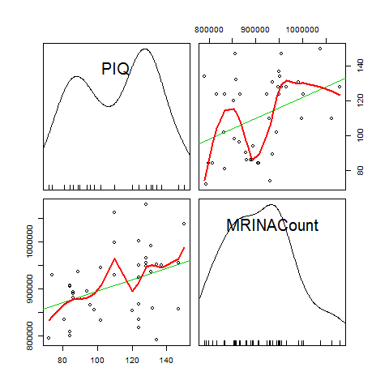
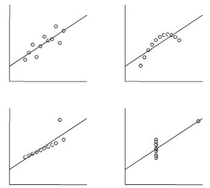
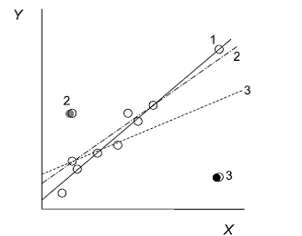
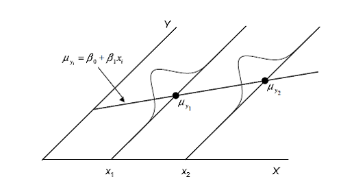
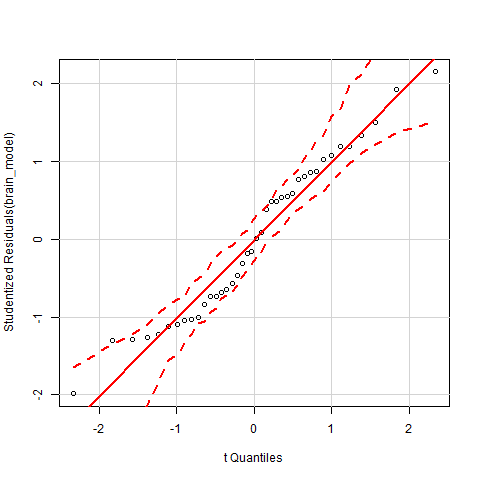
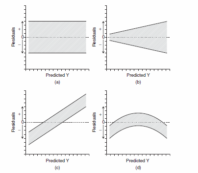

# Мы рассмотрим

+ Методы диагностики линейных моделей
+ Средства R, позвояющие провести такую диагностику


--- 

# Вы сможете
+ Использовать диагностические средства, реализованные в среде R, для проверки соблюдения условий применимости линейных моделей. 

```{r setup, include = FALSE, cache = FALSE, eval = -3}
#----------------------------------------------------------------
# RUN THE FRAGMENT BETWEEN LINES BEFORE COMPILING MARKDOWN
# to configure markdown parsing
options(markdown.extensions = 
          c("no_intra_emphasis",# skip markdown embedded in words
            "tables",           # create HTML tables
            "fenced_code",      # treat text as verbatim when surrounded with begin and ending lines with three ~ or ' characters.
            "autolink",         # create HTML links from urls and email addresses.
            "strikethrough",    # create strikethroughs by surrounding text with ~~.
            "lax_spacing",      # allow HTML tags inside paragraphs without being surrounded by newlines.
            "space_headers",    # add a space between header hashes and the header itself.
            "latex_math"))      # transforms all math equations into syntactically correct MathJax equations.
#--------------------------------------------------------------
# output options
options(width = 90, # set the maximum number of columns on a line
        scipen = 6, # fixed notation of floating point numbers, unless it is more than scipen digits wider, else - exponential notation
        digits = 4) # the number of digits to print when printing numeric values

# to render cyrillics in plots use cairo pdf
options(device = function(file, width = 7, height = 7, ...) {
  cairo_pdf(tempfile(), width = width, height = height, ...)
  })

# chunk default options
library(knitr)
opts_chunk$set(
#   fig.align='center',  # default figure alignment
               warnings = FALSE,
               message = FALSE,
               fig.width = 10,      # default figure width
               fig.height = 6)      # default figure height

# this allows for code formatting inline
knit_hooks$set(inline = function(x) {
   if (is.numeric(x)) return(knitr:::format_sci(x, 'latex'))
   x = as.character(x)
   h = knitr:::hilight_source(x, 'latex', list(prompt = FALSE, 
                                               size='normalsize', 
                                               highlight = FALSE))
   h = gsub("([_#$%&])", "\\\\\\1", h)
   h = gsub('(["\'])', '\\1{}', h)
   gsub('^\\\\begin\\{alltt\\}\\s*|\\\\end\\{alltt\\}\\s*$', '', h)})
```

---- .segue

# Первичное исследование данных

-----

#  Важнейший этап работы с моделями - это предварительное исследование данных (Data exploration)
+ Этот этап должен предшествовать построению модели
+ Самый правильный путь - это построить графики рассеяния, отражающие взаимосвязи между перемеными 

----

   


----- &twocol

# Исследование данных позвляет избежать неправомерного примнения метода 

*** =left
Например, один и тот же результат можно получить для совершенно разных данных

   

Из книги Quinn, Keough (2002) стр. 97

*** =right
>- Абсолютно разные облака точек описываются одной и той же моделью: $\hat y_i = 3.0 + 0.5x$  
>- Везде наблюдается очень высокая корреляция $r=0.68$  
>- Все модели "достоверны" : $H_0: \beta_1=0, t=4.24, p=0.002$  


----- 

# После того как данные исследованы, можно подобрать модель и оценть ее состоятельность.  

### Но! Если модель состоятельна и $H_0$ отвергнута, то не впадайте в эйфорию!  

### Надо еще проверить валидна ли ваша модель!  


---- .segue

# Проверка валидности модели

----

# Певый этап анализа валидности модели - это проверка на наличие влиятельных наблюдений 

_Влиятельные наблюдения_ - наблюдения, вносящие неправомерно большой вклад в оценку парметров (коэффициентов) модели.


   
Из кн. Quinn & Keugh, 2002

----

Сначала научимся извлекать из результатов необходимые сведения:
Для этого служит функция `fortify()` из пакета `{ggplot2}`
```{r}
require(ggplot2)
brain_diag <- fortify(brain_model)
head(brain_diag, 2)

```
Уже знакомые:
-------------------
`.fitted` - предсказанные значения   
`.resid` - остатки  
Новые величины, которые нам понадобятся:
------------------------------
`.hat` - "воздействие" данного наблюдения (_leverage_)  
`.cooksd` - расстояние Кука   
`.stdresid` - стандартизованные остатки  

----

# Типы остатков

Просто остатки: 
$$e_i = y_i - \hat{y_i}$$

Стандартизованные остатки:
$$\frac{e_i}{\sqrt{MS_{Residual}}}$$


Стьюдентовские остатки: 
$$\frac{e_i}{\sqrt{MS_{Residual}(1-h_i)}}$$


Последние удобнее, так как можно сказать какие остатки большие, а какие маленькие при сравнении разных моделей

---- &twocol
# Воздействие точек (Leverage)

*** =left


*** =right
>- Эта велична, показывает насколько каждое значение $x_i$ влияет на ход линии регрессии, то есть на $\hat{y_i}$  
<br>
>- Точки, располагающиеся дальше от $\bar{x}$, оказывают более сильное влияние на $\hat{y_i}$  
>- Эта величина, в норме, варьирует в промежутке от $1/n$ до 1  
>- Если  $h_i > 2(p/n)$, то надо внимательно посмотреть на данное значение  
>- Удобнее другая величина - расстояние Кука


---- &twocol

# Расстояние Кука (Cook's distance)  

*** =left

Описывает как повлияет на модель удаление данного наблюдения

$$D_i = \frac{\sum{(\hat{y_j}-\hat{y}_{j(i)})^2}}{pMSE}$$ 
$\hat{y_j}$ - значение предсказанное полной моделью  
$\hat{y}_{j(i)}$ - значение, предказанное моделью, построенной без учета $i$-го значения предиктора   
$p$ - количество параметров в модели   
$MSE$ - среднеквадратичная ошибка модели  

Расстояние Кука  одновременно учитывает величину остатков по всей модели и влиятельность (leverage) отдельных точек 

*** =right
>- Распределение статистики $D_i$ близко к F-распределению    
 - Если расстояние Кука $D_i > 1$, то данное наблюдение можно рассматривать как выброс (outlier)   
<br>
 - Для более жесткого выделения выбросов используют пороговую величину, зависящую от объема выборки $D_i > 4/(N − k − 1)$.  
 N - Объем выборки, k - число предикторов.

---- .prompt

# Задание
Для модели `brain_model` постройте график рссеяния стандартизированных остатков в зависимости от предсказанных значений

_Hint_: вспомните, что мы уже получили датафрейм `brain_diag`

----

# Решение 

```{r, fig.align='center', fig.width=8}
ggplot(data = brain_diag, aes(x = .fitted, y = .stdresid)) + 
  geom_point() + geom_hline(xintercept=0)
```

---- &twocol 

# Внесем некоторые дополнения 

*** =left
```{r, echo=FALSE, fig.width=7, fig.align='left'}
ggplot(data = brain_diag, aes(x = .fitted, y = .stdresid)) +
  geom_point(aes(size = .cooksd)) + 
  geom_hline(yintercept = 0) + 
  geom_smooth(method="loess", se=FALSE) 
```

*** =right
Что мы видим?
>- Большая часть стандартизованных остатков в пределах двух стандартных отклонений.
 - Есть одно влиятельное наблюдение, которое нужно проверить, но сила его влияния невелика.
 - Среди остатков нет тренда.
 - Но есть иной паттерн!   

----

# Что делать с влиятельными наблюдениями?

### Метод 1. Удаление влиятельных наблюдений   
_Будьте осторожны!_ Отскакивающие значения могут иметь важное значение.
Удалять следует только очевидные ошибки в наблюдениях.   
После их удаления необходимо пересчитать модель.   

-----

# Что делать с влиятельными наблюдениями?

### Метод 2. Преобразование переменных   
Наиболее частые преобразования, используемые для построения линейных моделей   

Трансформация  |  Формула  
------------- | -------------   
-2 | $1/Y^2$  
-1  | $1/Y$  
-0.5  | $1/\sqrt(Y)$  
логарифмирование | $log(Y)$  
0.5  | $\sqrt(Y)$  
 2| $Y^2$  
логит | $ln(\frac{Y}{1-Y})$  


---- .segue

# Допущения метода линейных моделей (Assumptions)

----

# Условия применимости линейных моделей
1. Линейность связи между зависимой перменной ($Y$) и предикторами ($X$)
2. Независимость $Y$ друг от друга
3. Нормальное распределение $Y$ для каждого уровня значенй $X$
4. Гомогенность дисерсии $Y$ в пределах всех уровней значений $X$
5. Фиксированные значения $X$
6. Отсутствие коллинеарности предикторов (для можественной регрессии)

----   

# Допущение 1. Линейность связи   

Нелинейные зависимости не всегда видны на исходных графиках в осях Y vs X
Они становятся лучше заметны на графиках рассеяния остатков (Residual plots)

```{r, echo=FALSE, fig.align='center', fig.align='center', fig.height=7}
library(ggplot2)
library(gridExtra)

x <- rnorm(100, 10, 3)
y <- (x^3) + rnorm(100, 0, 100)

pl_1 <- ggplot(data.frame(x=x, y=y), aes(x=x, y=y)) + geom_point() 

lm1 <- lm(y ~ x)

pl_1res <- ggplot(data.frame(fit=fitted(lm1), res=residuals(lm1)), aes(x=fit, y=res)) + geom_point() + geom_hline(yintercept=0) + xlab("Fitted") + ylab("Residuals")


x2 <- runif(100, 1, 10)

y2 <- sin(x2) + 0.5*x2 + rnorm(100, 0, 0.7)
 
pl_2 <- ggplot(data.frame(x=x2, y=y2), aes(x=x, y=y)) + geom_point() 

lm2 <- lm(y2 ~ x2)

pl_2res <- ggplot(data.frame(fit=fitted(lm2), res=residuals(lm2)), aes(x=fit, y=res)) + geom_point() + geom_hline(yintercept=0) + xlab("Fitted") + ylab("Residuals") 

grid.arrange(pl_1, pl_2, pl_1res, pl_2res)
```

----

# Что делать, если связь нелинейна?  

>- 1. Можно применить линеаризующее преобразование  
>- 2. Можно построить нелинейную модель (об этом будем говорить отдельно)

----

# Пример линеаризующего преобразования   

```{r, echo=FALSE, warning=FALSE, fig.align='center', fig.height=7}
x <- runif(100, 2, 5)
y <- (2^(2*x)) + rnorm(100, 0, 10)

pl_raw <- ggplot(data.frame(x=(x), y=(y)), aes(x=x, y=y)) + geom_point() + geom_smooth(method="lm") 

pl_log <- ggplot(data.frame(x= (x), y=log(y)), aes(x=x, y=y)) + geom_point() + geom_smooth(method="lm") + ylab("Log (y)")

grid.arrange(pl_raw, pl_log, ncol=2)

```


----

# Допущение 2. Независимость $Y$ друг от друга

* Каждое значение $Y_i$ должно быть независимо от любого $Y_j$ 
* Это должно контролироваться на этапе планирования сбора матриала 
* Наиболее частые источники зависимостей: 
  + псевдоповторности  
  + временные и пространственые автокорреляции   
* Взаимозависимоти могут проявляться на графиках рассеяния остатков  (Residual plots) 

-----

# Симулированный пример: Автокоррелированные данные.
```{r,echo=FALSE, fig.align='center', fig.height=7}
x3 <- seq(1, 100, 1)
  
  
y3 <-  diffinv(rnorm(99)) + rnorm(100, 0, 2)

y3 <- y3[1:100]
pl_3 <- ggplot(data.frame(x=x3, y=y3), aes(x=x, y=y)) + geom_point() + geom_smooth(method="lm")

lm3 <- lm(y3 ~ x3)

pl_3res <- ggplot(data.frame(fit=fitted(lm3), res=residuals(lm3)), aes(x=fit, y=res)) + geom_point() + geom_hline(yintercept=0) + xlab("Fitted") + ylab("Residuals")

grid.arrange(pl_3, pl_3res, nrow=2)
```

----

# Критерий Дарбина-Уотсона: Формальный тест на автокорреляцию

```{r}
brain_model <- lm(PIQ ~ MRINACount, data = brain)
durbinWatsonTest(brain_model)
```

---- &twocol 

# Симулированный пример: Автокоррелированные данные.

*** =left
Данные имеют ярко выраженную автокорреляцию
```{r, echo=FALSE, fig.height=7}
x <- seq(1, 100, 1)
y <-  diffinv(rnorm(99)) + rnorm(100, 0, 4)
dat <- data.frame(x, y)
ggplot(dat, aes(x=x, y=y)) + geom_point() + geom_smooth(method="lm")

```

*** =right
```{r}
lm_autocor <- lm(y ~ x, data = dat)
durbinWatsonTest(lm_autocor)
```

---- &twocol

# Допущение 3. Нормальное распределение $Y$ для каждого уровня значенй $X$ 

*** =left
   


*** =right
   

* $Y_i \sim N(\mu_{y_i}, \sigma^2)$
* В идеале, каждому $X_i$ должно соответствовать большое количество наблюдений $Y$ 
* На практике такое бывает только в случае моделей с дискретными предикторами
* Соответствие нормальности распределения можно оценить по "поведению" _случайной части модели_.

-----

# Фиксированная и случайная часть модели

$$y_i = \beta_0 + \beta_1x_i + \epsilon_i$$

>- Фиксированная часть: $y_i = \beta_0 + \beta_1x_i$ задает жесткую связь между $x_i$ и $y_i$
>- Случайная часть: $\epsilon_i$
>- Так как $y_i - \beta_0 - \beta_1x_i = 0$, то $\epsilon_i \sim N(0, \sigma^2)$ 
>- Если с моделью все ОК, то условие нормального распределения остатков должно соблюдаться

----

# Можно построить частотное распределение остатков
```{r, fig.hight=9}
ggplot(brain_model, aes(x=.stdresid)) + geom_histogram(bin=0.4, fill="blue", color="black") 

```

На частотной гистограмме остатков не всегда хорошо видны отклонения от нормальности

----

# Проверка нормальности распределения остатков с помощью нормальновероятностного графика стандартизованных остатков 

_Квантиль_ - значение, которое заданная случайная величина не превышает с фиксированной вероятностью.

  
Если точки - это случайные величины из $N(0, \sigma^2)$, то они должны лечь вдоль прямой $Y=X$

--- 

Все то же самое с использоваением возможностей `ggplot`

```{r, fig.height=6, fig.align='center'}
mean_val <- mean(brain_diag$.stdresid)
sd_val <- sd(brain_diag$.stdresid)
ggplot(brain_diag, aes(sample = .stdresid)) + geom_point(stat = "qq") + geom_abline(intercept = mean_val, slope = sd_val)
```

Мы видим, что отклонения от нормальности есть!  
Но! Метод устойчив к небольшим отклонениям от нормальности.


--- 

# Допущение 4. Постоянство дисперсии - гомоскедастичность
Это самое важное ограничивающее условие!   
Оценки коэффициентов уравнения регрессии при гетероскедастичности не смещаются, но сильно смещаются стандартные ошибки.  
Многие тесты чувствительны к гетероскедастичности. 

Если линия регрессии подобрана для гетероскедастичных данных, то повышается вероятность ошибки II рода  

```{r, echo=FALSE, warning=FALSE, fig.height=6, fig.align='center'}
library(ggplot2)
library(gridExtra)

set.seed(12345)
x <- rnorm(1000,10, 3)
b_0 <- 100 
b_1 <- 20
h <- function(x) 10* x 
eps <- rnorm(1000, 0, h(x))
y <- b_0 + b_1*x + eps
dat <- data.frame(x, y)
dat$log_y <- log(y)
pl_heter <- ggplot(dat, aes(x=x, y=y)) + geom_point() + geom_smooth(method="lm")

dat_diag <- fortify(lm(y~x, data=dat))
pl_heter_resid <- ggplot(dat_diag, aes(x = .fitted, y = .stdresid)) + geom_point() + geom_smooth(se=FALSE)

grid.arrange (pl_heter, pl_heter_resid, nrow=2)

```

---- &twocol

# Формальные тесты на гетероскедастичность

*** =left
+ Для линейных моделей с непрерывным предиктором применяется, например, тест Бройша-Пагана (Breusch-Pagan test)  
+ Для моделей с дискретными предикторами чаще применяют тест Кокрана (Cochran test)

*** =right
```{r}
library(lmtest)
#Симулированные данные
bptest(y ~ x, data = dat) 
#Реальные данные
bptest(PIQ ~ MRINACount, data = brain) 
```


----  &twocol 
# Что делать если вы столкнулись с гетероскедастичностью?

Решение 1. Применить преобразование зависимой переменной (в некоторых случаях и предиктора).  

*** =left
```{r, echo=FALSE,warning=FALSE, fig.width=6, fig.align='left'}

dat_diag2 <- fortify(lm(log_y~x, data=dat))


pl_heter2 <- ggplot(dat, aes(x=x, y=log_y)) + geom_point() + geom_smooth(method="lm")

pl_heter_resid2 <- ggplot(dat_diag2, aes(x = .fitted, y = .stdresid)) + geom_point() + geom_smooth(se=FALSE)

pl_heter <- pl_heter + ggtitle("No transformation")
pl_heter2 <- pl_heter2 + ggtitle("Log transformed Y")


grid.arrange (pl_heter, pl_heter2,  pl_heter_resid, pl_heter_resid2,  nrow=2)

```

*** =right
Недостатки:  
1. Не всегда спасает.  
2. Модель описывает поведение не исходной, а преобразованной величины. _"Если вы не можете доказать А, докажите В и сделайте вид, что это было А"_ (Кобаков, 2014)  

----

# Что делать если вы столкнулись с гетероскедастичностью?

Решение 2. Построить более сложную модель, которая учитывала бы гетерогенность дисперсии зависимой перменной.  

"Welcome to our world, the world of _mixed effects modelling_."(Zuur et al., 2009)  

Об этом речь впереди!


---- &twocol

# Некоторые распространенные паттерны на диаграммах рассеяния остатков 

*** =left
 

из Logan, 2010, стр. 174  

*** =right
a) Случайное рассеяние остатков. Гомогенность дисперсии и линейность соблюдаются. _Модель хорошая!_  
b) Клиновидный паттерн. Есть гетероскедастичность. _Модель плохая!_   
c) Остатки рассеяны равномерно, но модель неполна. Нужны дополниетльные предикторы. _Модель можно улучшить!_   
d) Нелинейнй паттерн сохранился. Линейная модель применена некорректно. _Модель плохая!_  

---

# Можно автоматически проверить допущения с помощью средств R
HO! Будьте осторожны. 
```{r}
library(gvlma)
gvlma(brain_model)

```

----

# Допущение 5. Фиксированные значения предикторов 

Мы рассматривали регрессионную модель I (Model I regression).   
Она требует, чтобы при каждом новом исследовании уровни предиктора $x_i$ были бы теми же самыми.  

В биологии это условие обычно не соблюдается, так как мы работаем с материалом, в котором выборочными значениями являются как $Y$, так и $X$.  

То есть, $x_i$ являются случайными величинами. Они не контролируются исследователем.


-----

# Допущение 5. Фиксированные значения предикторов 

Если наша цель - построить модель, которая будет предсказывать значения $Y$ в зависимсоти от $X$, то можно использовать регрессионную модель I, но  оценка $\beta_1$ будет немного занижена. Модель будет недопредсказывать. 


Если наша цель - выявление истинной взаимосвязи между $Y$ и $X$ (то есть важна оценка $\beta_1$) придется учитывать, что есть не только $\epsilon_y$, но также и $\delta_x$

В этой ситуации используют иной способ подбора линии регрессии

----- &twocol

# Допущение 5. Фиксированные значения предикторов 
Подбор линии регрессии для регрессионной модели II (Model II regression)

*** =left


из книги Quinn & Keugh, 2002, стр. 101

*** =right
```{r}
library(lmodel2)
brain_lm2 <- lmodel2(PIQ ~ MRINACount, data = brain, range.y="relative", range.x="relative", nperm=99)
brain_lm2
```

---- .prompt


# Задание: Выполните три блока кода (см. код лекции). 
### Какие нарушения условий применимости линейных моделей здесь наблюдаются?


----

# Что нужно писать в тексте статьи по поводу проверки валидности моделей?
>- Вариант 1. Привести электронные дополнительные материалы с необходимыми графиками.
>- Вариант 2. Привести в тексте работы результаты применения тестов на гомогеность дисперси, автокоррелированность (если используются пространственые или временные предикторы) и нормальность распределиня остатков.
>- Вариант3. Написать в главе _"Материал и методика"_ фразу вроде такой: "Визуальная проверка графиков рассяния остатков не выявила заметных отклонений от условий равенства дисперсий и нормальности".


----

# Summary
>- Перед построением модели необходимо провести исследование данных.  
>- Не любая модель с достверными результатами проверки $H_0$ валидна.  
>- Обязательный этап работы с моделями - проверка условий применимости.  
>- Если значения предикторов $X$ случайны и принцпиальное значение для исследования имеет  _значение_ коэффициентов уравнения регрессии, то применяется регрессионная модель II.

----

# Что почитать
+ Кабаков Р.И. R в действии. Анализ и визуализация данных на языке R. М.: ДМК Пресс, 2014.
+ Quinn G.P., Keough M.J. (2002) Experimental design and data analysis for biologists, pp. 92-98, 111-130
+ Diez D. M., Barr C. D., Cetinkaya-Rundel M. (2014) Open Intro to Statistics., pp. 354-367.
+ Logan M. (2010) Biostatistical Design and Analysis Using R. A Practical Guide, pp. 170-173, 208-211
+ Legendre P., Legendre L. (2012) Numerical ecology. Second english edition. Elsevier, Amsterdam. (Дается подробное описание Model II regression)
