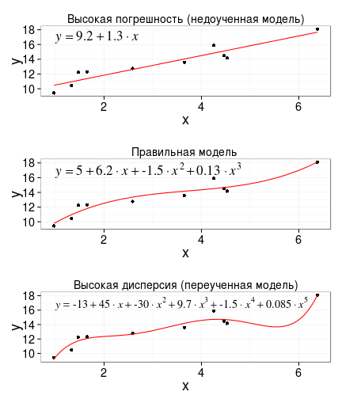
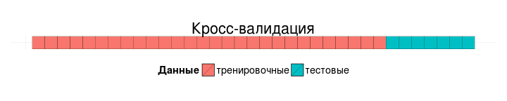
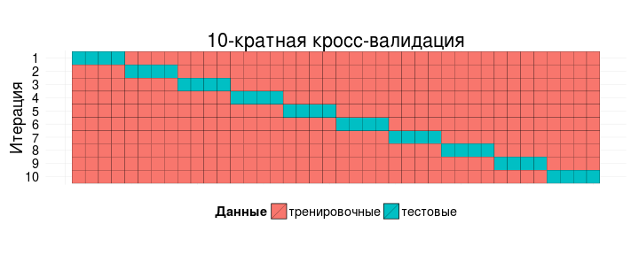
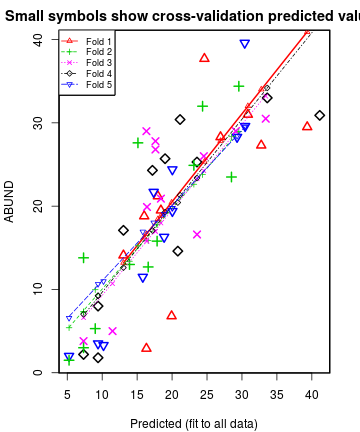

## Сравнение линейных моделей

- Зачем нужно сравнивать модели?
- Принципы выбора лучшей линейной модели
- Тестирование гипотез при помощи сравнения линейных моделей
- Сравнение моделей по качеству подгонки к данным*
- Сравнение предсказательной силы линейных моделей с использованием кросс-валидации

### Вы сможете

- Объяснить связь между качеством описания существующих данных и краткостью модели
- Объяснить, что такое "переобучение" модели
- Рассказать, каким образом происходит кросс-валидация моделей
- Протестировать влияние отдельных параметров линейной регрессии при помощи сравнения вложенных моделей
- Подобрать модель с оптимальной точностью подгонки к данным, оцененной по коэффициенту детерминации с поправкой или по $C _p$ Маллоу
- Оценить предсказательную силу модели при помощи k-кратной кросс-валидации

- 


--- .segue

# Зачем нужно сравнивать модели?

--- &twocol

## Пример: птицы в лесах Австралии

*** =left

От каких характеристик лесного участка зависит обилие птиц в лесах юго-западной Виктории, Австралия (Loyn, 1987)

56 лесных участков:
- ABUND - обилие птиц
- YR.ISOL - год изоляции участка
- GRAZE - пастбищная нагрузка (1-5)
- ALT - высота над уровнем моря
- L10DIST - логарифм расстояния до ближайшего леса
- L10LDIST - логарифм расстояния до ближайшего большого леса
- L10AREA - логарифм площади


```r
birds <- read.csv("loyn.csv")
```


*** =right


<small>Mystic Forest - Warburton, Victoria by ¡kuba! on flickr</small>


---

## Нужна оптимальная модель

От каких характеристик лесного участка зависит обилие птиц в лесах юго-западной Виктории, Австралия (Loyn, 1987)

Переменных много, хотим из них выбрать __оптимальный небольшой__ набор:

- При помощи разных критериев подберем несколько подходящих кандидатов
- Выберем лучшую модель с небольшим числом параметров

--- .segue

# Принципы выбора лучшей линейной модели

## "Essentially, all models are wrong, but some are useful"  (Georg E. P. Box) 

---

## Принципы выбора лучшей модели

Эти критерии конкурируют друг с другом

### Хорошее описание существующих данных

Если мы включим много переменных, то лучше опишем данные

Стандартные ошибки параметров будут большие, интерпретация сложная

Большой $R^2$, маленький MSe

### Парсимония

Минимальный набор переменных, который может объяснить существующие данные

Стандартные ошибки параметров будут низкие, интерпретация простая

--- &twocol

## Компромисс при подборе оптимальной модели:<br />точность / смещенная оценка

*** =left

### Переобучение

Переобучение происходит, когда модель, из-за избыточного усложнения, описывает не только отношения между переменными, но и случайный шум

При увеличении числа предикторов в модели (при ее усложнении), она точнее опишет данные, по которым подобрана, но на новых данных точность предсказаний будет низкой из-за "переобучения" (overfitting).

Легче всего проиллюстрировать на примере полиномиальной регрессии

*** =right



---

## Критерии и методы выбора моделей зависят от задачи

### Объяснение закономерностей
- Тестирование гипотез о влиянии факторов или удаление влияния одних переменных, для изучения других
- Нужны точные тесты влияния предикторов: F-тесты (о нем сейчас) или likelihood-ratio тесты

### Описание закономерностей
- Описание функциональной зависимости между зависимой переменной и предикторами
- Нужна точность оценки параметров и парсимония: $C _p$ Маллоу, "информационные" критерии (АIC, BIC, AICc, QAIC, и т.д.)

### Предсказание
- Предсказание значений зависимой переменной для __новых__ данных
- Нужна оценка качества модели на новых данных с использованием кросс-валидации (о ней сейчас)

---

## Не позволяйте компьютеру думать за вас!

### Дополнительные критерии для сравнения моделей:

- Диагностические признаки и качество подгонки:
	- остатки, автокорреляция, кросс-корреляция, распределение ошибок, выбросы и проч.
- Посторонние теоритические соображения:
	- разумность, целесообразность модели, простота, ценность выводов

--- .segue

# Тестирование гипотез при помощи сравнения линейных моделей

---

## Для тестирования гипотез о влиянии фактора можно сравнить модели с этим фактором и без него.

- Можно сравнивать для тестирования гипотез только вложенные модели (справедливо для F-критерия и для likelihood-ratio тестов)

---

## Вложенные модели (nested models)

Две модели являются вложенными, если одну из них можно получить из другой, приравнивая некоторые коэффициенты более сложной модели к 0.

Какие из этих моделей вложены и в какие именно?

### Полная модель (full model)

$y _i = \beta _0 + \beta _1 x _1 + \beta _2 x _2 + \epsilon _i$

### Неполные модели (reduced models)

$y _i = \beta _0 + \beta _1 x _1 + \epsilon _i$

$y _i = \beta _0 + \beta _2 x _2 + \epsilon _i$

### Нулевая модель (null model)

$y _i = \beta _0 + \epsilon _i$

> - Неполные модели являются вложенными по отношению к полной модели, нулевая модель - вложенная по отношению к полной и к неполным. 
- Неполные модели по отношению друг к другу - __не__ вложенные

--- .prompt &twocol

## Задание:

Запишите все вложенные модели для данной полной модели

(1) $y _i = \beta _0 + \beta _1 x _1 + \beta _2 x _2 + \beta _3 x _3 + \epsilon _i$

*** =left

> - Модели:
  - (2) $y _i = \beta _0 + \beta _1 x _1 + \beta _2 x _2 + \epsilon _i$
  - (3) $y _i = \beta _0 + \beta _1 x _1 + \beta _3 x _3 + \epsilon _i$
  - (4) $y _i = \beta _0 + \beta _2 x _2 + \beta _3 x _3 + \epsilon _i$
  - (5) $y _i = \beta _0 + \beta _1 x _1 + \epsilon _i$
  - (6) $y _i = \beta _0 + \beta _2 x _2 + \epsilon _i$
  - (7) $y _i = \beta _0 + \beta _3 x _3 + \epsilon _i$
  - (8) $y _i = \beta _0 + \epsilon _i$

*** =right

> - Вложенность:
  - (2)-(4) - вложены в (1)<br /><br /><br />
  - (5)-(7) - вложены в (1), при этом 
     - (5) вложена в (1), (2), (3); 
     - (6) вложена в (1), (2), (4); 
     - (7) вложена в (1), (3), (4)<br /><br />
  - (8) - нулевая модель - вложена во все

---

## Сравнение линейных моделей при помощи F-критерия

### Полная модель 

$y _i = \beta _0 + \beta _1 x _{i1} + ... + \beta _k x _{ik} + ... + \beta _p x _{ip} + \epsilon _i$

$df _{reduced, full} = p$, $df _{error, full} = n - p - 1$

### Уменьшенная модель

$y _i = \beta _0 + \beta _1 x _{i1} + ... + \beta _k x _{ik} + \epsilon _i$

$df _{reduced, reduced} = k$, $df _{error, reduced} = n - k - 1$

### F-критерий для сравнения моделей

Есть ли выигрыш от включения фактора в модель?

$$F = \frac {(SS _{error,reduced} - SS _{error,full}) / (df _{reduced, full} - df _{reduced, reduced})} {(SS _{error, full})/ df _{error, full}}$$

--- .prompt

## Задание:

- Запишите формулу модели, которая описывает, как зависит обилие птиц в лесах Австралии (ABUND) от переменных:
  - YR.ISOL - год изоляции участка
  - GRAZE - пастбищная нагрузка (1-5)
  - ALT - высота над уровнем моря
  - L10DIST - логарифм расстояния до ближайшего леса
  - L10LDIST - логарифм расстояния до ближайшего большого леса
  - L10AREA - логарифм площади

```
frm_full <- 
```

- Подберите модель, используя эту формулу
- Какие переменные можно протестировать на предмет возможности исключения из модели?

---

## Решение

L10DIST, L10LDIST, YR.ISOL не влияют


```r
frm_full <- ABUND ~ L10AREA + L10DIST + YR.ISOL + L10LDIST + GRAZE
lm_full <- lm(frm_full, birds)
summary(lm_full)
```

```
# 
# Call:
# lm(formula = frm_full, data = birds)
# 
# Residuals:
#     Min      1Q  Median      3Q     Max 
# -16.368  -3.521   0.527   2.637  14.794 
# 
# Coefficients:
#              Estimate Std. Error t value  Pr(>|t|)    
# (Intercept) -111.7820    89.7814   -1.25     0.219    
# L10AREA        7.7557     1.4175    5.47 0.0000014 ***
# L10DIST       -1.2567     2.6321   -0.48     0.635    
# YR.ISOL        0.0694     0.0447    1.55     0.127    
# L10LDIST      -1.1065     2.0399   -0.54     0.590    
# GRAZE         -1.8843     0.8881   -2.12     0.039 *  
# ---
# Signif. codes:  0 '***' 0.001 '**' 0.01 '*' 0.05 '.' 0.1 ' ' 1
# 
# Residual standard error: 6.36 on 50 degrees of freedom
# Multiple R-squared:  0.681,	Adjusted R-squared:  0.649 
# F-statistic: 21.3 on 5 and 50 DF,  p-value: 2.36e-11
```

---

## Сравнение линейных моделей при помощи (частного) F-критерия

функция `anova(модель_1, модель_2)` в R

Модели обязательно должны быть вложенными!

---

## Протестируем, нужны ли переменные L10LDIST, L10DIST, YR.ISOL

Переменные, удаление которых __не ухудшает__ модель, можно будет удалить и получить минимальную осмысленную модель (не термин:)

### Тестируем L10LDIST


```r
frm_ldist <- ABUND ~ L10AREA + L10DIST + YR.ISOL + GRAZE
lm_ldist <- lm(frm_ldist, birds)
anova(lm_ldist, lm_full)
```

```
# Analysis of Variance Table
# 
# Model 1: ABUND ~ L10AREA + L10DIST + YR.ISOL + GRAZE
# Model 2: ABUND ~ L10AREA + L10DIST + YR.ISOL + L10LDIST + GRAZE
#   Res.Df  RSS Df Sum of Sq    F Pr(>F)
# 1     51 2036                         
# 2     50 2024  1      11.9 0.29   0.59
```

> - L10LDIST не улучшает модель - выбрасываем

---

## Тестируем L10DIST, при условии, что L10LDIST уже нет в модели


```r
frm_dist <- ABUND ~ L10AREA + YR.ISOL + GRAZE
lm_dist <- lm(frm_dist, birds)
anova(lm_dist, lm_ldist)
```

```
# Analysis of Variance Table
# 
# Model 1: ABUND ~ L10AREA + YR.ISOL + GRAZE
# Model 2: ABUND ~ L10AREA + L10DIST + YR.ISOL + GRAZE
#   Res.Df  RSS Df Sum of Sq    F Pr(>F)
# 1     52 2071                         
# 2     51 2036  1      35.4 0.89   0.35
```

> - L10DIST не улучшает модель - выбрасываем

---

## Тестируем YR.ISOL, при условии, что L10DIST и L10LDIST нет в модели


```r
frm_yrisol <- ABUND ~ L10AREA + GRAZE
lm_yrisol <- lm(frm_yrisol, birds)
anova(lm_yrisol, lm_dist)
```

```
# Analysis of Variance Table
# 
# Model 1: ABUND ~ L10AREA + GRAZE
# Model 2: ABUND ~ L10AREA + YR.ISOL + GRAZE
#   Res.Df  RSS Df Sum of Sq    F Pr(>F)  
# 1     53 2201                           
# 2     52 2071  1       130 3.26  0.077 .
# ---
# Signif. codes:  0 '***' 0.001 '**' 0.01 '*' 0.05 '.' 0.1 ' ' 1
```

> - L10LDIST не улучшает модель - выбрасываем

---

## А вот GRAZE выкинуть не получится


```r
frm_graze <- ABUND ~ L10AREA
lm_graze <- lm(frm_graze, birds)
anova(lm_graze, lm_dist)
```

```
# Analysis of Variance Table
# 
# Model 1: ABUND ~ L10AREA
# Model 2: ABUND ~ L10AREA + YR.ISOL + GRAZE
#   Res.Df  RSS Df Sum of Sq    F  Pr(>F)    
# 1     54 2867                              
# 2     52 2071  2       796 9.99 0.00021 ***
# ---
# Signif. codes:  0 '***' 0.001 '**' 0.01 '*' 0.05 '.' 0.1 ' ' 1
```

- GRAZE улучшает модель - нужно оставить

## Минимальная модель


```r
frm_yrisol
```

```
# ABUND ~ L10AREA + GRAZE
```

--- .segue

# Сравнение моделей по качеству подгонки к данным*

<div class = "footnote">в этой лекции - без информационных критериев</div>

---

## Коэффициент детерминации

Обычный коэффициент детерминации оценивает долю объясненной изменчивости

$$R^2 = \frac {SS _{regression}} {SS _{total}}$$

### $R^2 _{adjusted}$

Доля объясненной изменчивости с поправкой на число предикторов

$$R^2 _{adjusted} = 1 - (1 - R^2) \frac {n-1} {n-k} \le R^2$$

_n_ - число наблюдений,  
_k_ - количество параметров в модели

### У хорошей модели будет большой $R^2 _{adjusted}$

---

## $C _p$ Мэллоу (Mallow's $C _p$)

Оценивает "общую ошибку предсказания" с использованием _p_-параметров

$$C _p = \frac {SS _{error, p-predictors}}{MS _{error, full}} - (n - 2p)$$

### $C _p$ Мэллоу связан с F-критерием

$$C _p = p + (F _p - 1) (m + 1 - p)$$

_m_ - общее число возможных параметров  
_p_ - число параметров в уменьшенной модели

### У хорошей модели $C _p \approx p$

- Если нет ошибки предсказания, то $F _p \approx 1$ и $C _p \approx p$

- Если есть ошибка предсказания, то $F _p > 1$ и $C _p > p$

---

## Найдем лучшую из всех моделей по коэффициенту детерминации


```r
library(leaps)
crit_ar2 <- leaps(x = birds[, c(3, 6:10)], y = birds$ABUND,
                  names = names(birds[, c(3, 6:10)]), 
                  method = "adjr2")
# crit_ar2$size # число предикторов
# crit_ar2$which # предикторы в модели
# crit_ar2$adjr2 # R^2 adj. для модели

# Номер строки лучшей модели (модели с макс. adjr2)
best_ar2 <- which.max(crit_ar2$adjr2)
# Какие переменные входят в модель?
crit_ar2$which[best_ar2, ]
```

```
#  YR.ISOL    GRAZE      ALT  L10DIST L10LDIST  L10AREA 
#     TRUE     TRUE     TRUE    FALSE    FALSE     TRUE
```

```r
# Записываем формулу лучшей модели по adjr2 
frm_ar2 <- ABUND ~ YR.ISOL + GRAZE + ALT + L10AREA
```

<small>В нашем случае переменных немного, можем перебрать все модели кандидаты. Если переменных много, можно использовать пошаговые процедуры (опасно) или тестировать несколько осмысленных кандидатов</small>

--- .prompt

## Задание: 

Выберите лучшую модель по значению $C _p$ Маллоу

Нужно изменить параметр `method` в функции `leaps()`

У лучшей модели будет минимальным модуль разницы между ее числом параметров и $C _p$

---

## Решение


```r
crit_cp <- leaps(x = birds[, c(3, 6:10)], y = birds$ABUND, names = names(birds[, c(3, 6:10)]), method = "Cp")
# Ищем лучшую модель
# полную модель нужно исключить
n_mod <- length(crit_cp$size) 
best_cp <- which.min(abs(crit_cp$size[-n_mod] - crit_cp$Cp[-n_mod]))
# Какие переменные входят в модель?
crit_cp$which[best_cp, ]
```

```
#  YR.ISOL    GRAZE      ALT  L10DIST L10LDIST  L10AREA 
#    FALSE     TRUE    FALSE    FALSE     TRUE     TRUE
```

```r
frm_cp <- ABUND ~ GRAZE + L10DIST + L10AREA
```

---

## Какую из моделей выбрать, если мы хотим предсказывать с их помощью

Теперь у нас есть три многообещающих модели кандидата


```r
frm_yrisol
```

```
# ABUND ~ L10AREA + GRAZE
```

```r
frm_ar2
```

```
# ABUND ~ YR.ISOL + GRAZE + ALT + L10AREA
```

```r
frm_cp
```

```
# ABUND ~ GRAZE + L10DIST + L10AREA
```

Оценим их предсказательную силу

--- .segue

# Сравнение предсказательной силы линейных моделей с использованием кросс-валидации

--- &twocol

## Кросс-валидация

Если оценивать качество модели по тем же данным, по которым она была подобрана, оценки будут завышенными

Кросс-валидация решает эту проблему

Делим данные __случайным образом__ на __тренировочное и тестовое подмножества__, обычно в пропорции 60:40, 70:30 или 80:20



*** =left

### Тренировочные данные

Используются для подбора модели (для обучения)
  
Чтобы модель была хорошей, тренировочных данных __должно быть много__ 

*** =right

### Тестовые данные

Используются для оценки качества модели
  
Чтобы надежно оценить качество модели, тестовых данных __тоже должно быть много__

---

## K-кратная кросс-валидация (k-fold cross-validation)

Делим данные __случайным образом__ на $k$ частей  
$k - 1$ часть используется для обучения, на $k$-й части тестируется модель  
Процедура повторяется $k$ раз



$k$-кратная кросс-валидация лучше обычной, особенно, если данных не много

---

## RMSE - стандартная ошибка предсказания

$$RMSE = \sqrt { \frac {\sum{(\hat {y _{i}} - y _{i})^2}} {n} }$$

Это параметр, который определяет ширину доверительных интервалов предсказаний

Очень чувствительна к выборосам (альтернатива - MAE - средний модуль ошибок)

Можно сравнивать между моделями, только если они в одинаковых единицах (исходные данные моделей (не)преобразованы одинаково, зависимая переменная в одних и тех же единицах)

Нет жестких границ для RMSE "хорошей" модели, это относительная величина.

Бывает, что критерии противоречат друг другу, тогда решаем с учетом других соображений, например, простоты и интерпретируемости. Лучше меньше параметров.

---

## Этапы сравнения моделей с использованием кросс-валидации

- Делим данные на тренировочное и тестовое подмножества

- Для каждой из моделей-кандидатов повторяем следующие шаги
  - Подбираем на тренировочном подмножестве модель-кандидат
  - Используя тестовые данные, предсказываем ожидаемые значение $y$ используя модель-кандидат
  - Рассчитываем RMSE для модели-кандидата (стандартное отклонение остатков)

$$RMSE = \sqrt { \frac {\sum{(\hat {y _{i}} - y _{i})^2}} {n} }$$

- Сравниваем RMSE всех моделей кандидатов. Модель, у которой минимальное значение RMSE - лучшая

--- &twocol

## Кросс-валидация для линейных моделей

`CVlm`(df = `исходные_данные`, form.lm = `формула`, m = `кратность`)

*** =left


```r
library(DAAG)
val_yrisol <- CVlm(df = birds, form.lm = frm_yrisol, m = 5)
```

```
# Analysis of Variance Table
# 
# Response: ABUND
#           Df Sum Sq Mean Sq F value  Pr(>F)    
# L10AREA    1   3471    3471    83.6 1.8e-12 ***
# GRAZE      1    666     666    16.0 0.00019 ***
# Residuals 53   2201      42                    
# ---
# Signif. codes:  
# 0 '***' 0.001 '**' 0.01 '*' 0.05 '.' 0.1 ' ' 1
```

```
# 
# fold 1 
# Observations in test set: 11 
#                  6    13    18     25    28    31
# Predicted   13.042 17.97  16.3 18.404 16.01  19.9
# cvpred      13.211 18.45  16.7 18.829 16.25  20.4
# ABUND       14.100 21.20   2.9 19.500 18.80   6.8
# CV residual  0.889  2.75 -13.8  0.671  2.55 -13.6
#                 45   47    50    52    55
# Predicted   26.934 24.6 30.85 32.76  39.3
# cvpred      27.841 25.3 32.02 34.02  40.9
# ABUND       28.300 37.7 31.00 27.30  29.5
# CV residual  0.459 12.4 -1.02 -6.72 -11.4
# 
# Sum of squares = 720    Mean square = 65.4    n = 11 
# 
# fold 2 
# Observations in test set: 12 
#                 1     3     5    10   11    23     30
# Predicted    9.01  5.26  7.34  7.34 15.1 17.86 13.910
# cvpred       9.97  5.40  7.32  7.32 15.2 17.77 13.389
# ABUND        5.30  1.50 13.80  3.00 27.6 15.80 13.000
# CV residual -4.67 -3.90  6.48 -4.32 12.4 -1.97 -0.389
#                40    41    42    46    51
# Predicted   16.58 28.50 23.12 24.37 29.55
# cvpred      15.86 28.34 22.63 23.78 28.94
# ABUND       12.70 23.50 24.90 32.00 34.40
# CV residual -3.16 -4.84  2.27  8.22  5.46
# 
# Sum of squares = 390    Mean square = 32.5    n = 12 
# 
# fold 3 
# Observations in test set: 11 
#                 7   17   22    26    29   33    34
# Predicted    7.34 16.3 11.5 18.40 16.41 17.6 17.62
# cvpred       6.62 15.9 10.7 17.98 15.78 17.0 16.97
# ABUND        3.80 29.0  5.0 20.90 19.90 27.8 26.80
# CV residual -2.82 13.1 -5.7  2.92  4.12 10.8  9.83
#               35    38       43    53
# Predicted   23.6 24.54 29.11992 33.41
# cvpred      23.3 24.26 28.99437 33.21
# ABUND       16.6 26.00 29.00000 30.50
# CV residual -6.7  1.74  0.00563 -2.71
# 
# Sum of squares = 505    Mean square = 46    n = 11 
# 
# fold 4 
# Observations in test set: 11 
#                 4     8    12    14    15    19    24
# Predicted   13.04  7.34  9.41 20.82  9.41 17.19 23.57
# cvpred      12.61  7.02  9.25 20.43  9.25 17.07 23.38
# ABUND       17.10  2.20  1.80 14.60  8.00 24.30 25.30
# CV residual  4.49 -4.82 -7.45 -5.83 -1.25  7.23  1.92
#                36    39    54    56
# Predicted   21.15 19.00 33.62  41.1
# cvpred      21.32 19.29 34.19  42.3
# ABUND       30.40 25.70 33.00  30.9
# CV residual  9.08  6.41 -1.19 -11.4
# 
# Sum of squares = 444    Mean square = 40.4    n = 11 
# 
# fold 5 
# Observations in test set: 11 
#                 2     9    16     20    21    27    32
# Predicted    5.26 10.19  9.41 20.044 20.04 18.87 17.36
# cvpred       6.57 10.98 10.65 19.779 19.78 19.06 18.02
# ABUND        2.00  3.30  3.50 19.400 24.40 16.30 21.70
# CV residual -4.57 -7.68 -7.15 -0.379  4.62 -2.76  3.68
#                37     44   48      49
# Predicted   15.81 29.301 30.4 30.4554
# cvpred      16.93 28.431 29.5 29.5634
# ABUND       11.50 28.300 39.6 29.6000
# CV residual -5.43 -0.131 10.1  0.0366
# 
# Sum of squares = 305    Mean square = 27.7    n = 11 
# 
# Overall (Sum over all 11 folds) 
#   ms 
# 42.2
```

*** =right



--- .prompt

## Задание:

Посчитайте RMSE для модели val_yrisol

$$RMSE = \sqrt { \frac {\sum{(\hat {y _{i}} - y _{i})^2}} {n} }$$

$\hat {y _{i}}$ - это предсказанные во время кросс-валидации значения - `val_yrisol$cvpred`

$y _{i}$ - это реальные наблюдаемые значения зависимой переменной - `val_yrisol$ABUND`

---

## Решение


```r
# RMSE вручную
sqrt(mean((val_yrisol$cvpred - val_yrisol$ABUND)^2))
```

```
# [1] 6.5
```

### Можно создать пользовательскую функцию для рассчета RMSE


```r
rmse <- function(cv_obj, y_name){
  sqrt(mean((cv_obj$cvpred - cv_obj[, y_name])^2))
}

# теперь можно пользоваться функцией
rmse(val_yrisol, "ABUND")
```

```
# [1] 6.5
```

---

## Задание

- Сделайте 5-кратную кросс-валидацию оставшихся двух моделей и полной модели

```
frm_cp
frm_ar2
frm_full
```

- Посчитайте их RMSE

Какая из моделей-кандидатов дает более качественные предсказания?

---

## Решение

Кросс-валидация


```r
val_cp <- CVlm(df = birds, form.lm = frm_cp, m = 5)
val_ar2 <- CVlm(df = birds, form.lm = frm_ar2, m = 5)
val_full <- CVlm(df = birds, form.lm = frm_full, m = 5)
```

Считаем RMSE


```r
rmse(val_cp, "ABUND")
```

```
# [1] 6.5
```

```r
rmse(val_ar2, "ABUND")
```

```
# [1] 6.84
```

```r
rmse(val_full, "ABUND")
```

```
# [1] 6.93
```

---

## Какие модели дают более качественные предсказания?


```r
rmse(val_yrisol, "ABUND"); rmse(val_cp, "ABUND") 
```

```
# [1] 6.5
```

```
# [1] 6.5
```

```r
rmse(val_ar2, "ABUND"); rmse(val_full, "ABUND")
```

```
# [1] 6.84
```

```
# [1] 6.93
```

Судя по значениям RMSE, это модели


```r
frm_yrisol
```

```
# ABUND ~ L10AREA + GRAZE
```

```r
frm_cp
```

```
# ABUND ~ GRAZE + L10DIST + L10AREA
```

В данном случае можно предпочесть `frm_yrisol` как более простую

---

## Takehome messages

- Модели, которые качественно описывают существующие данные включают много параметров, но предсказания с их помощью менее точны из-за переобучения
- Для выбора оптимальной модели используются разные критерии в зависимости от задачи
  - Сравнивая вложенные модели можно отбраковать переменные, включение которых в модель не улучшает ее
  - Оптимальный набор переменных для более качественного описания __существующих данных__ можно подобрать сравнивая модели по $R^2 _{adjusted}$ и $C _p$ Маллоу
  - Оценить предсказательную силу модели на __новых данных__ можно при помощи кросс-валидации сравнив ошибки предсказаний

---

## Дополнительные ресурсы

James, G., Witten, D., Hastie, T., Tibshirani, R., 2013. An introduction to statistical learning. Springer.
  - 2.1.3 The Trade-Off Between Prediction Accuracy and Model Interpretability
  - 2.2.2 The Bias-Variance Trade-Off
  - 3.2.2 Some Important Questions

Kuhn, M., Johnson, K., 2013. Applied Predictive Modeling. Springer.
  - 1.1 Prediction Versus Interpretation
  - 1.2 Key Ingredients of Predictive Models
  - 4 Over-Fitting and Model Tuning
  - 5 Measuring Performance in Regression Models

Quinn, G.G.P., Keough, M.J., 2002. Experimental design and data analysis for biologists. Cambridge University Press.
  - 6.1.15 Finding the “best” regression model
  - 6.1.16 Hierarchical partitioning
