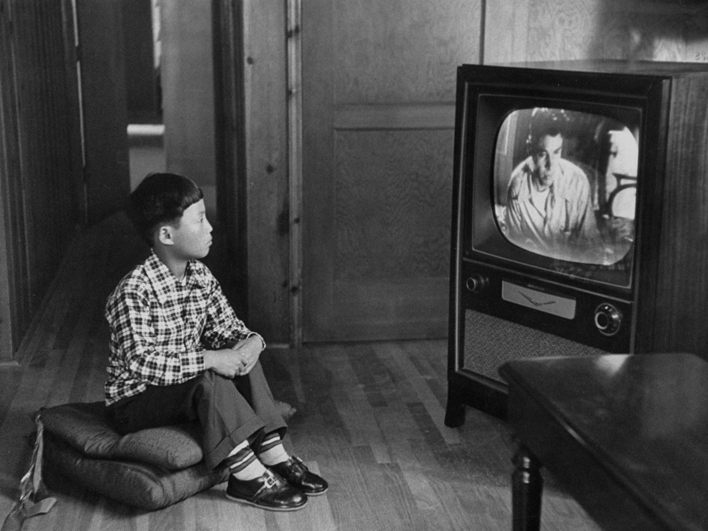

## Мы рассмотрим

+ Линейные модели, включающие в себя, как непрерывные, так и дискретные предикторы
+ Простейший экспериментальный план, требующий анализа ковариации (ANCOVA)

### Вы сможете

+ Написать R-код, необходимый для подгонки линейной модели, включающей как дскретные, так и непрерывные предикторы
+ Дать трактовку коэффициентам такой линейной модели  

```{r setup, include = FALSE, cache = FALSE, eval = -3}
#----------------------------------------------------------------
# RUN THE FRAGMENT BETWEEN LINES BEFORE COMPILING MARKDOWN
# to configure markdown parsing
options(markdown.extensions = 
          c("no_intra_emphasis",# skip markdown embedded in words
            "tables",           # create HTML tables
            "fenced_code",      # treat text as verbatim when surrounded with begin and ending lines with three ~ or ' characters.
            "autolink",         # create HTML links from urls and email addresses.
            "strikethrough",    # create strikethroughs by surrounding text with ~~.
            "lax_spacing",      # allow HTML tags inside paragraphs without being surrounded by newlines.
            "space_headers",    # add a space between header hashes and the header itself.
            "latex_math"))      # transforms all math equations into syntactically correct MathJax equations.
#--------------------------------------------------------------
# output options
options(width = 90, # set the maximum number of columns on a line
        scipen = 6, # fixed notation of floating point numbers, unless it is more than scipen digits wider, else - exponential notation
        digits = 4) # the number of digits to print when printing numeric values

# to render cyrillics in plots use cairo pdf
options(device = function(file, width = 7, height = 7, ...) {
  cairo_pdf(tempfile(), width = width, height = height, ...)
  })

# chunk default options
library(knitr)
opts_chunk$set(
#   fig.align='center',  # default figure alignment
               warnings = FALSE,
               message = FALSE,
               fig.width = 10,      # default figure width
               fig.height = 6)      # default figure height

# this allows for code formatting inline
knit_hooks$set(inline = function(x) {
   if (is.numeric(x)) return(knitr:::format_sci(x, 'latex'))
   x = as.character(x)
   h = knitr:::hilight_source(x, 'latex', list(prompt = FALSE, 
                                               size='normalsize', 
                                               highlight = FALSE))
   h = gsub("([_#$%&])", "\\\\\\1", h)
   h = gsub('(["\'])', '\\1{}', h)
   gsub('^\\\\begin\\{alltt\\}\\s*|\\\\end\\{alltt\\}\\s*$', '', h)})
```

---- &twocol

## Кто дольше смотрит телевизор?

*** =left 

+ Было опрошено 2068 студентов, обучающихся на курсах по статистике одного из американских университетов.
+ Каждый студент был оценен по 14 параметрам
+ Мы рассмотрим лишь часть

Зависимая перменная:   
watchtv - вемя, проводимое за просмотром телепердач (часы в неделю)   
<br>
Независимые предикторы:   
age  - возраст (годы)   
miles - расстояние от места жительства студента до университета (мили)   
year - курс обучения   
gender - пол   


Пример взят с сайта http://www.amstat.org/publications/jse/jse_data_archive.htm   
файл: eyecolorgenderdata.csv 

*** =right 

   

----

## Смотрим на датасет  

```{r}
tv <- read.csv("eyecolorgenderdata.csv", header = TRUE)
head(tv)
```

---

Непрерывные (continuous) предикторы
------------------
`age`   
`miles`  

Дискретные предикторы, или факторы (categorical factors)
-------------------
`year` 
```{r}
levels(tv$year)
```


`gender` 
```{r}
levels(tv$gender)
```


---

## Можо ли педсказать время, затраченное на просмотр телепередач, для студентов, обучающихся на разных курсах?
<br>
<br>

Это означает, что мы должны построить модель, предсказывающую время просмотра TV в зависмости от дискретного предиктора `year` 

---- &twocol

# Представляем графически связь между зависимой переменной и предиктором

*** =left
```{r, eval=FALSE}
library(ggplot2)
ggplot(tv, aes(x = year, y = log(watchtv + 1)))  + 
  geom_boxplot() + geom_point() + 
  geom_jitter(position = position_jitter(width = 0.1)) + 
  stat_summary(fun.y=mean, colour="blue", geom="point", 
               size=5, show_guide = FALSE)
```

*** =right
```{r, echo=FALSE, warning=FALSE, fig.width=6}
library(ggplot2)
ggplot(tv, aes(x = year, y = log(watchtv + 1)))  + 
  geom_boxplot(color = "red") + geom_point(size=0.5) + 
  geom_jitter(position = position_jitter(width = 0.1)) + 
  stat_summary(fun.y=mean, colour="blue", geom="point", 
               size=5, show_guide = FALSE)
```

----- &twocol 

## Строим линейую модель, связывающую зависимую переменную и предиктор

*** =left
```{r}
tv_model1 <- lm(watchtv ~ year, data = tv)
summary(tv_model1)
```

*** =right
```{r}
anova(tv_model1)
```


----

## Суть коэффициентов в модели с дискретными предикторами

$$ y_i = \beta_0 + \beta_1I_{level_1} + \beta_2I_{level_2} + ... + \beta_mI_{level_m} + \epsilon_i$$


$\beta_0$ - свободный член (intercept)   
$\epsilon_i$ - неучтенная моделью изменчивость   

$\beta_m$ - показывает на сколько единиц отличается среднее значение $Y$ для m-го уровня предиктора от уровня, выбранного за базовый.   
<br>
_Базовый уровень_ выбирается в зависимости от целей исследования. По умолчанию, функция `lm()` выбирает за базовый уровень первое по алфавиту значение (в нашей модели - year = `first`).   
<br>
$I_{level_m}$ - _dummy variable_, логическй "переключатель", множитель, принимающий значение 1 или 0, в зависимости от того, какой предиктор рассматривается.   

----

## Суть коэффициентов в модели с дискретными предикторами

### Средние значения для каждого уровня

Среднее значение для базового уровня дискретного предиктора
$$y_{mean_{ref}} = b_0 + \beta_1*0 + \beta_2*0 + ... + \beta_m*0$$

Среднее значение для первого, после базового, уровня
$$y_{mean_1} = b_0 + \beta_1*1 + \beta_2*0 + ... + \beta_m*0$$

Среднее значение для второго, после базового, уровня
$$y_{mean_2} = b_0 + \beta_1*0 + \beta_2*1 + ... + \beta_m*0$$

Среднее значение для  `m`-го, после базового, уровня
$$y_{mean_m} = b_0 + \beta_1*0 + \beta_2*0 + ... + \beta_m*1$$


----

## Подставим подобранные коэффициенты в модель

```{r}
coefficients(tv_model1)
```

<br>
$$y_{mean} = 9.3299595 + 0.2013884I_{fourth} + 2.1917796 I_{other} -0.5050316I_{second} + 0.1595771I_{third}$$

----

## Задание: используя знание коэффициентов линейной модели, вычислите средние значения зависимой переменной для каждого уровня предиктора `year`


----

## Решение 
```{r}
#first
9.3299595 + 0.2013884*0 + 2.1917796*0 -0.5050316*0 + 0.1595771*0

#fourth
9.3299595 + 0.2013884*1 + 2.1917796*0 -0.5050316*0 + 0.1595771*0

#other
9.3299595 + 0.2013884*0 + 2.1917796*1 -0.5050316*0 + 0.1595771*0

#second
9.3299595 + 0.2013884*0 + 2.1917796*0 -0.5050316*1 + 0.1595771*0

#third
9.3299595 + 0.2013884*0 + 2.1917796*0 -0.5050316*0 + 0.1595771*1
```

----

## Сверим результаты с результатами, полученными иным способом   

```{r}
means <- function(x) mean(x, na.rm=TRUE)

mean_year <- tapply(tv$watchtv, tv$year, FUN = means)
mean_year
```

----

## Иными словами, среднее значение для каждого из уровней дискретного предиктора вычисляется так

$$y _{mean _{ref}} = \beta _0$$   
$$y _{mean _1}=\beta _0 + \beta _1$$   
$$y _{mean _2}=\beta _0 + \beta _2$$   
$$y _{mean _m}=\beta _0 + \beta _m$$  
  

----

# Вопрос: Что произойдет с моделью, если поменять базовый уровень?

----

## Меняем базовый уровень
```{r}
tv_model2 <- lm(watchtv ~ relevel(year, ref="other"), data = tv)
coefficients(tv_model2)
```

---- &twocol
## Изменилась ли суть модели от изменения базового уровня?

*** =left
```{r}
summary(tv_model1)
```

*** =right
```{r}
summary(tv_model2)
```

----

## О чем говорят значения t-критерия?

```{r}
summary(tv_model2)
```


----

## Все действия с моделями, включающими дискретные предикторы, аналогичны действиям с обычным регрессионными моделями

Диагностика
------------
```{r}
# library(car)
# residualPlots(tv_model1)
tv_model_diag <- fortify(tv_model1)
head(tv_model_diag)
```

-----

## Residual plot
```{r, fig.align='center', fig.height=6, message=FALSE}
ggplot(tv_model_diag, aes(x = .fitted, y = .stdresid, size = .cooksd)) + geom_point() + geom_hline(yintercept=0) + geom_smooth(se = FALSE)

```

-----

Диагностика
------------
```{r}
library(car)
library(lmtest)
bptest(tv_model1)
durbinWatsonTest(tv_model1)

```

----

## Оценка состоятельности модели с помощью функции `anova()`

```{r}
anova(tv_model1)
```

----

## В одну модель можно включить одновременно и дискретные, и неперывные предикторы!

```{r}
tv_model3 <- lm(watchtv ~  age + miles + gender + year, data = tv)

```

----

## Посмотрим на результаты подбора модели 

###Вопрос. Кто, мужчины или женщины, в среднем смотрят телевизор дольше и на сколько часов?

```{r}
summary(tv_model3)
```


----- 

## Задание. Попробуйте оптимизировать полную модель.

_Hint_ Для этого вам понадбится полную и вложенную в нее редуцированную модель


----- &twocol

## Решение

*** =left
```{r}
tv_model_reduced <- lm(watchtv ~  miles + gender + 
                         year, data = tv)
anova(tv_model3, tv_model_reduced)
```

*** =right
```{r}
summary(tv_model_reduced)
```


----- .prompt

## Классический коварационный анализ (ANCOVA)

### Часто используется в экспериментальных работах

---- &twocol

## Пример

*** =left

## Как влияет на прирост массы коз интенсивность профилактики паразитарных заболеваний?
<br>
Пример взят из библиотеки данных   
http://www.statlab.uni-heidelberg.de/data/ancova/goats.data  
Из датасета удалено два измерения

*** =right


   

----

## Читаем данные

```{r}
goat <- read.csv("Goat_treatment_1.csv")
```

-----

## Задание: 
1. Постройте модель, описывающую зависимость между увеличением веса коз и способом прфилактической обработки животных.     
2. Оцените состоятельность этой модели.  

----

## Решение 

```{r}
goat_model <- lm(Weightgain ~ Treatment, data = goat)
summary(goat_model)
```

----

## Необходимо учитывать ковариату - начальный вес коз!

```{r}
goat_model_cov <- lm(Weightgain ~ Treatment + Initial_wt, data = goat)
summary(goat_model_cov)
```

Вопрос: Как измеяет прирост при использовании более интесивной профилактики? 

----

## Визуализация результатов анализа

```{r, fig.align='center'}
ggplot(goat, aes(x = Initial_wt, y = Weightgain, color = Treatment)) + 
  geom_point(size=3) + geom_smooth(method = "lm", se = FALSE, size=2) 
```

----
## Summary


>- Коэффициенты регрессии при дискретных предикторах позволяют сопоставить средние значения для каждого уровня фактора со средним уровнем некоторого базового уровня данного предиктора.
>- При изменении базового уровня, коэффициенты изменятся, но суть модиели останется той же.
>- В одной модели можно объединить как непрерывные, так и дискретные предикторы.
>- При анализе экспериметальных данных, включение в анализ некоторых ковариат может помочь лучше увидеть закономерности.

----

## Что почитать
+ Quinn G.P., Keough M.J. (2002) Experimental design and data analysis for biologists, `Chapter 12`.
