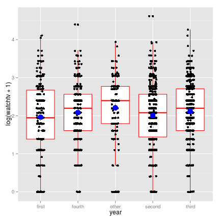
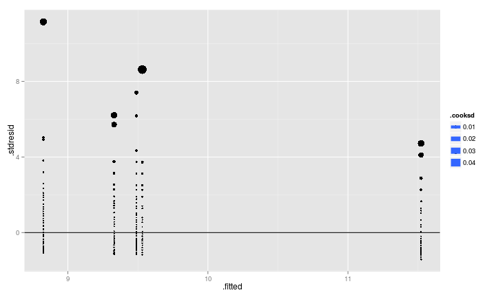
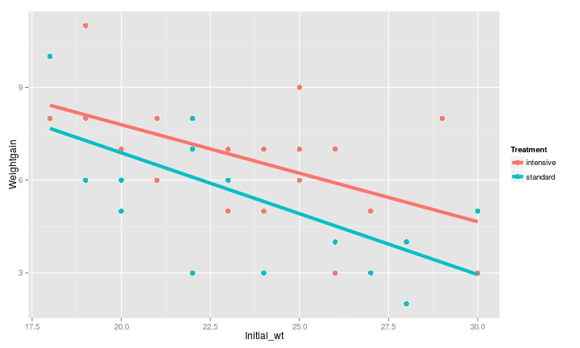

## Мы рассмотрим

+ Линейные модели, включающие в себя, как непрерывные, так и дискретные предикторы
+ Простейший экспериментальный план, требующий анализа ковариации (ANCOVA)

### Вы сможете

+ Написать R-код, необходимый для подгонки линейной модели, включающей как дскретные, так и непрерывные предикторы
+ Дать трактовку коэффициентам такой линейной модели  


---- &twocol

## Кто дольше смотрит телевизор?

*** =left 

+ Было опрошено 2068 студентов, обучающихся на курсах по статистике одного из американских университетов.
+ Каждый студент был оценен по 14 параметрам
+ Мы рассмотрим лишь часть

Зависимая перменная:   
watchtv - вемя, проводимое за просмотром телепердач (часы в неделю)   
<br>
Независимые предикторы:   
age  - возраст (годы)   
miles - расстояние от места жительства студента до университета (мили)   
year - курс обучения   
gender - пол   


Пример взят с сайта http://www.amstat.org/publications/jse/jse_data_archive.htm   
файл: eyecolorgenderdata.csv 

*** =right 

   

----

## Смотрим на датасет  


```r
tv <- read.csv("eyecolorgenderdata.csv", header = TRUE)
head(tv)
```

```
##   gender age   year eyecolor height miles brothers sisters computertime exercise
## 1 female  18  first    hazel     68   195        0       1           20      Yes
## 2   male  20  third    brown     70   120        3       0           24       No
## 3 female  18  first    green     67   200        0       1           35      Yes
## 4   male  23 fourth    hazel     74   140        1       1            5      Yes
## 5 female  19 second     blue     62    60        0       1            5      Yes
## 6   male  19 second    green     67     0        0       1            5      Yes
##   exercisehours musiccds playgames watchtv
## 1             3       75         6      18
## 2             0       50         0       3
## 3             3       53         8       1
## 4            25       50         0       7
## 5             4       30         2       5
## 6             8      100         0      10
```

---

Непрерывные (continuous) предикторы
------------------
`age`   
`miles`  

Дискретные предикторы, или факторы (categorical factors)
-------------------
`year` 

```r
levels(tv$year)
```

```
## [1] "first"  "fourth" "other"  "second" "third"
```


`gender` 

```r
levels(tv$gender)
```

```
## [1] "female" "male"
```


---

## Можо ли педсказать время, затраченное на просмотр телепередач, для студентов, обучающихся на разных курсах?
<br>
<br>

Это означает, что мы должны построить модель, предсказывающую время просмотра TV в зависмости от дискретного предиктора `year` 

---- &twocol

# Представляем графически связь между зависимой переменной и предиктором

*** =left

```r
library(ggplot2)
ggplot(tv, aes(x = year, y = log(watchtv + 1)))  + 
  geom_boxplot() + geom_point() + 
  geom_jitter(position = position_jitter(width = 0.1)) + 
  stat_summary(fun.y=mean, colour="blue", geom="point", 
               size=5, show_guide = FALSE)
```

*** =right
 

----- &twocol 

## Строим линейую модель, связывающую зависимую переменную и предиктор

*** =left

```r
tv_model1 <- lm(watchtv ~ year, data = tv)
summary(tv_model1)
```

```
## 
## Call:
## lm(formula = watchtv ~ year, data = tv)
## 
## Residuals:
##    Min     1Q Median     3Q    Max 
## -11.52  -5.53  -1.82   3.18  91.18 
## 
## Coefficients:
##             Estimate Std. Error t value Pr(>|t|)    
## (Intercept)    9.330      0.520   17.93   <2e-16 ***
## yearfourth     0.201      0.693    0.29    0.771    
## yearother      2.192      0.869    2.52    0.012 *  
## yearsecond    -0.505      0.606   -0.83    0.405    
## yearthird      0.160      0.609    0.26    0.793    
## ---
## Signif. codes:  0 '***' 0.001 '**' 0.01 '*' 0.05 '.' 0.1 ' ' 1
## 
## Residual standard error: 8.18 on 2062 degrees of freedom
##   (1 observation deleted due to missingness)
## Multiple R-squared:  0.00622,	Adjusted R-squared:  0.00429 
## F-statistic: 3.22 on 4 and 2062 DF,  p-value: 0.012
```

*** =right

```r
anova(tv_model1)
```

```
## Analysis of Variance Table
## 
## Response: watchtv
##             Df Sum Sq Mean Sq F value Pr(>F)  
## year         4    863   215.7    3.22  0.012 *
## Residuals 2062 137900    66.9                 
## ---
## Signif. codes:  0 '***' 0.001 '**' 0.01 '*' 0.05 '.' 0.1 ' ' 1
```


----

## Суть коэффициентов в модели с дискретными предикторами

$$ y_i = \beta_0 + \beta_1I_{level_1} + \beta_2I_{level_2} + ... + \beta_mI_{level_m} + \epsilon_i$$


$\beta_0$ - свободный член (intercept)   
$\epsilon_i$ - неучтенная моделью изменчивость   

$\beta_m$ - показывает на сколько единиц отличается среднее значение $Y$ для m-го уровня предиктора от уровня, выбранного за базовый.   
<br>
_Базовый уровень_ выбирается в зависимости от целей исследования. По умолчанию, функция `lm()` выбирает за базовый уровень первое по алфавиту значение (в нашей модели - year = `first`).   
<br>
$I_{level_m}$ - _dummy variable_, логическй "переключатель", множитель, принимающий значение 1 или 0, в зависимости от того, какой предиктор рассматривается.   

----

## Суть коэффициентов в модели с дискретными предикторами

### Средние значения для каждого уровня

Среднее значение для базового уровня дискретного предиктора
$$y_{mean_{ref}} = b_0 + \beta_1*0 + \beta_2*0 + ... + \beta_m*0$$

Среднее значение для первого, после базового, уровня
$$y_{mean_1} = b_0 + \beta_1*1 + \beta_2*0 + ... + \beta_m*0$$

Среднее значение для второго, после базового, уровня
$$y_{mean_2} = b_0 + \beta_1*0 + \beta_2*1 + ... + \beta_m*0$$

Среднее значение для  `m`-го, после базового, уровня
$$y_{mean_m} = b_0 + \beta_1*0 + \beta_2*0 + ... + \beta_m*1$$


----

## Подставим подобранные коэффициенты в модель


```r
coefficients(tv_model1)
```

```
## (Intercept)  yearfourth   yearother  yearsecond   yearthird 
##      9.3300      0.2014      2.1918     -0.5050      0.1596
```

<br>
$$y_{mean} = 9.3299595 + 0.2013884I_{fourth} + 2.1917796 I_{other} -0.5050316I_{second} + 0.1595771I_{third}$$

----

## Задание: используя знание коэффициентов линейной модели, вычислите средние значения зависимой переменной для каждого уровня предиктора `year`


----

## Решение 

```r
#first
9.3299595 + 0.2013884*0 + 2.1917796*0 -0.5050316*0 + 0.1595771*0
```

```
## [1] 9.33
```

```r
#fourth
9.3299595 + 0.2013884*1 + 2.1917796*0 -0.5050316*0 + 0.1595771*0
```

```
## [1] 9.531
```

```r
#other
9.3299595 + 0.2013884*0 + 2.1917796*1 -0.5050316*0 + 0.1595771*0
```

```
## [1] 11.52
```

```r
#second
9.3299595 + 0.2013884*0 + 2.1917796*0 -0.5050316*1 + 0.1595771*0
```

```
## [1] 8.825
```

```r
#third
9.3299595 + 0.2013884*0 + 2.1917796*0 -0.5050316*0 + 0.1595771*1
```

```
## [1] 9.49
```

----

## Сверим результаты с результатами, полученными иным способом   


```r
means <- function(x) mean(x, na.rm=TRUE)

mean_year <- tapply(tv$watchtv, tv$year, FUN = means)
mean_year
```

```
##  first fourth  other second  third 
##  9.330  9.531 11.522  8.825  9.490
```

----

## Иными словами, среднее значение для каждого из уровней дискретного предиктора вычисляется так

$$y _{mean _{ref}} = \beta _0$$   
$$y _{mean _1}=\beta _0 + \beta _1$$   
$$y _{mean _2}=\beta _0 + \beta _2$$   
$$y _{mean _m}=\beta _0 + \beta _m$$  
  

----

# Вопрос: Что произойдет с моделью, если поменять базовый уровень?

----

## Меняем базовый уровень

```r
tv_model2 <- lm(watchtv ~ relevel(year, ref="other"), data = tv)
coefficients(tv_model2)
```

```
##                        (Intercept)  relevel(year, ref = "other")first 
##                             11.522                             -2.192 
## relevel(year, ref = "other")fourth relevel(year, ref = "other")second 
##                             -1.990                             -2.697 
##  relevel(year, ref = "other")third 
##                             -2.032
```

---- &twocol
## Изменилась ли суть модели от изменения базового уровня?

*** =left

```r
summary(tv_model1)
```

```
## 
## Call:
## lm(formula = watchtv ~ year, data = tv)
## 
## Residuals:
##    Min     1Q Median     3Q    Max 
## -11.52  -5.53  -1.82   3.18  91.18 
## 
## Coefficients:
##             Estimate Std. Error t value Pr(>|t|)    
## (Intercept)    9.330      0.520   17.93   <2e-16 ***
## yearfourth     0.201      0.693    0.29    0.771    
## yearother      2.192      0.869    2.52    0.012 *  
## yearsecond    -0.505      0.606   -0.83    0.405    
## yearthird      0.160      0.609    0.26    0.793    
## ---
## Signif. codes:  0 '***' 0.001 '**' 0.01 '*' 0.05 '.' 0.1 ' ' 1
## 
## Residual standard error: 8.18 on 2062 degrees of freedom
##   (1 observation deleted due to missingness)
## Multiple R-squared:  0.00622,	Adjusted R-squared:  0.00429 
## F-statistic: 3.22 on 4 and 2062 DF,  p-value: 0.012
```

*** =right

```r
summary(tv_model2)
```

```
## 
## Call:
## lm(formula = watchtv ~ relevel(year, ref = "other"), data = tv)
## 
## Residuals:
##    Min     1Q Median     3Q    Max 
## -11.52  -5.53  -1.82   3.18  91.18 
## 
## Coefficients:
##                                    Estimate Std. Error t value Pr(>|t|)    
## (Intercept)                          11.522      0.696   16.55  < 2e-16 ***
## relevel(year, ref = "other")first    -2.192      0.869   -2.52  0.01175 *  
## relevel(year, ref = "other")fourth   -1.990      0.833   -2.39  0.01699 *  
## relevel(year, ref = "other")second   -2.697      0.762   -3.54  0.00041 ***
## relevel(year, ref = "other")third    -2.032      0.765   -2.66  0.00792 ** 
## ---
## Signif. codes:  0 '***' 0.001 '**' 0.01 '*' 0.05 '.' 0.1 ' ' 1
## 
## Residual standard error: 8.18 on 2062 degrees of freedom
##   (1 observation deleted due to missingness)
## Multiple R-squared:  0.00622,	Adjusted R-squared:  0.00429 
## F-statistic: 3.22 on 4 and 2062 DF,  p-value: 0.012
```

----

## О чем говорят значения t-критерия?


```r
summary(tv_model2)
```

```
## 
## Call:
## lm(formula = watchtv ~ relevel(year, ref = "other"), data = tv)
## 
## Residuals:
##    Min     1Q Median     3Q    Max 
## -11.52  -5.53  -1.82   3.18  91.18 
## 
## Coefficients:
##                                    Estimate Std. Error t value Pr(>|t|)    
## (Intercept)                          11.522      0.696   16.55  < 2e-16 ***
## relevel(year, ref = "other")first    -2.192      0.869   -2.52  0.01175 *  
## relevel(year, ref = "other")fourth   -1.990      0.833   -2.39  0.01699 *  
## relevel(year, ref = "other")second   -2.697      0.762   -3.54  0.00041 ***
## relevel(year, ref = "other")third    -2.032      0.765   -2.66  0.00792 ** 
## ---
## Signif. codes:  0 '***' 0.001 '**' 0.01 '*' 0.05 '.' 0.1 ' ' 1
## 
## Residual standard error: 8.18 on 2062 degrees of freedom
##   (1 observation deleted due to missingness)
## Multiple R-squared:  0.00622,	Adjusted R-squared:  0.00429 
## F-statistic: 3.22 on 4 and 2062 DF,  p-value: 0.012
```


----

## Все действия с моделями, включающими дискретные предикторы, аналогичны действиям с обычным регрессионными моделями

Диагностика
------------

```r
# library(car)
# residualPlots(tv_model1)
tv_model_diag <- fortify(tv_model1)
head(tv_model_diag)
```

```
##   watchtv   year     .hat .sigma     .cooksd .fitted .resid .stdresid
## 1      18  first 0.004049  8.178 0.000917537   9.330  8.670    1.0623
## 2       3  third 0.001495  8.179 0.000188823   9.490 -6.490   -0.7941
## 3       1  first 0.004049  8.178 0.000846969   9.330 -8.330   -1.0207
## 4       7 fourth 0.003135  8.180 0.000060450   9.531 -2.531   -0.3100
## 5       5 second 0.001441  8.179 0.000063226   8.825 -3.825   -0.4681
## 6      10 second 0.001441  8.180 0.000005967   8.825  1.175    0.1438
```

-----

## Residual plot

```r
ggplot(tv_model_diag, aes(x = .fitted, y = .stdresid, size = .cooksd)) + geom_point() + geom_hline(yintercept=0) + geom_smooth(se = FALSE)
```



-----

Диагностика
------------

```r
library(car)
library(lmtest)
bptest(tv_model1)
```

```
## 
## 	studentized Breusch-Pagan test
## 
## data:  tv_model1
## BP = 2.898, df = 4, p-value = 0.5751
```

```r
durbinWatsonTest(tv_model1)
```

```
##  lag Autocorrelation D-W Statistic p-value
##    1        -0.01281         2.024   0.652
##  Alternative hypothesis: rho != 0
```

----

## Оценка состоятельности модели с помощью функции `anova()`


```r
anova(tv_model1)
```

```
## Analysis of Variance Table
## 
## Response: watchtv
##             Df Sum Sq Mean Sq F value Pr(>F)  
## year         4    863   215.7    3.22  0.012 *
## Residuals 2062 137900    66.9                 
## ---
## Signif. codes:  0 '***' 0.001 '**' 0.01 '*' 0.05 '.' 0.1 ' ' 1
```

----

## В одну модель можно включить одновременно и дискретные, и неперывные предикторы!


```r
tv_model3 <- lm(watchtv ~  age + miles + gender + year, data = tv)
```

----

## Посмотрим на результаты подбора модели 

###Вопрос. Кто, мужчины или женщины, в среднем смотрят телевизор дольше и на сколько часов?


```r
summary(tv_model3)
```

```
## 
## Call:
## lm(formula = watchtv ~ age + miles + gender + year, data = tv)
## 
## Residuals:
##    Min     1Q Median     3Q    Max 
## -13.96  -5.47  -1.91   3.54  85.55 
## 
## Coefficients:
##              Estimate Std. Error t value     Pr(>|t|)    
## (Intercept)  9.237913   1.526265    6.05 0.0000000017 ***
## age         -0.046673   0.076061   -0.61      0.53953    
## miles        0.000540   0.000162    3.33      0.00089 ***
## gendermale   1.807176   0.362732    4.98 0.0000006818 ***
## yearfourth   0.294231   0.740318    0.40      0.69109    
## yearother    2.323852   0.955360    2.43      0.01508 *  
## yearsecond  -0.428570   0.609407   -0.70      0.48198    
## yearthird    0.178809   0.626024    0.29      0.77519    
## ---
## Signif. codes:  0 '***' 0.001 '**' 0.01 '*' 0.05 '.' 0.1 ' ' 1
## 
## Residual standard error: 8.12 on 2043 degrees of freedom
##   (17 observations deleted due to missingness)
## Multiple R-squared:  0.0233,	Adjusted R-squared:  0.02 
## F-statistic: 6.97 on 7 and 2043 DF,  p-value: 0.000000031
```


----- 

## Задание. Попробуйте оптимизировать полную модель.

_Hint_ Для этого вам понадбится полную и вложенную в нее редуцированную модель


----- &twocol

## Решение

*** =left

```r
tv_model_reduced <- lm(watchtv ~  miles + gender + 
                         year, data = tv)
anova(tv_model3, tv_model_reduced)
```

```
## Analysis of Variance Table
## 
## Model 1: watchtv ~ age + miles + gender + year
## Model 2: watchtv ~ miles + gender + year
##   Res.Df    RSS Df Sum of Sq    F Pr(>F)
## 1   2043 134610                         
## 2   2044 134635 -1     -24.8 0.38   0.54
```

*** =right

```r
summary(tv_model_reduced)
```

```
## 
## Call:
## lm(formula = watchtv ~ miles + gender + year, data = tv)
## 
## Residuals:
##    Min     1Q Median     3Q    Max 
## -13.94  -5.47  -1.93   3.52  85.68 
## 
## Coefficients:
##              Estimate Std. Error t value   Pr(>|t|)    
## (Intercept)  8.363751   0.547654   15.27    < 2e-16 ***
## miles        0.000531   0.000162    3.29      0.001 ** 
## gendermale   1.788124   0.361345    4.95 0.00000081 ***
## yearfourth   0.135875   0.693776    0.20      0.845    
## yearother    2.079047   0.867941    2.40      0.017 *  
## yearsecond  -0.456088   0.607662   -0.75      0.453    
## yearthird    0.095458   0.611016    0.16      0.876    
## ---
## Signif. codes:  0 '***' 0.001 '**' 0.01 '*' 0.05 '.' 0.1 ' ' 1
## 
## Residual standard error: 8.12 on 2044 degrees of freedom
##   (17 observations deleted due to missingness)
## Multiple R-squared:  0.0232,	Adjusted R-squared:  0.0203 
## F-statistic: 8.08 on 6 and 2044 DF,  p-value: 0.0000000121
```


----- .prompt

## Классический коварационный анализ (ANCOVA)

### Часто используется в экспериментальных работах

---- &twocol

## Пример

*** =left

## Как влияет на прирост массы коз интенсивность профилактики паразитарных заболеваний?
<br>
Пример взят из библиотеки данных   
http://www.statlab.uni-heidelberg.de/data/ancova/goats.data  
Из датасета удалено два измерения

*** =right


   

----

## Читаем данные


```r
goat <- read.csv("Goat_treatment_1.csv")
```

-----

## Задание: 
1. Постройте модель, описывающую зависимость между увеличением веса коз и способом прфилактической обработки животных.     
2. Оцените состоятельность этой модели.  

----

## Решение 


```r
goat_model <- lm(Weightgain ~ Treatment, data = goat)
summary(goat_model)
```

```
## 
## Call:
## lm(formula = Weightgain ~ Treatment, data = goat)
## 
## Residuals:
##    Min     1Q Median     3Q    Max 
## -3.737 -1.579  0.263  1.263  4.421 
## 
## Coefficients:
##                   Estimate Std. Error t value Pr(>|t|)    
## (Intercept)          6.737      0.469   14.37   <2e-16 ***
## Treatmentstandard   -1.158      0.663   -1.75    0.089 .  
## ---
## Signif. codes:  0 '***' 0.001 '**' 0.01 '*' 0.05 '.' 0.1 ' ' 1
## 
## Residual standard error: 2.04 on 36 degrees of freedom
## Multiple R-squared:  0.0781,	Adjusted R-squared:  0.0525 
## F-statistic: 3.05 on 1 and 36 DF,  p-value: 0.0892
```

----

## Необходимо учитывать ковариату - начальный вес коз!


```r
goat_model_cov <- lm(Weightgain ~ Treatment + Initial_wt, data = goat)
summary(goat_model_cov)
```

```
## 
## Call:
## lm(formula = Weightgain ~ Treatment + Initial_wt, data = goat)
## 
## Residuals:
##    Min     1Q Median     3Q    Max 
##  -3.04  -1.23  -0.04   0.94   3.26 
## 
## Coefficients:
##                   Estimate Std. Error t value     Pr(>|t|)    
## (Intercept)        15.0081     1.8676    8.04 0.0000000019 ***
## Treatmentstandard  -1.1765     0.5342   -2.20        0.034 *  
## Initial_wt         -0.3539     0.0783   -4.52 0.0000672692 ***
## ---
## Signif. codes:  0 '***' 0.001 '**' 0.01 '*' 0.05 '.' 0.1 ' ' 1
## 
## Residual standard error: 1.65 on 35 degrees of freedom
## Multiple R-squared:  0.418,	Adjusted R-squared:  0.385 
## F-statistic: 12.6 on 2 and 35 DF,  p-value: 0.0000767
```

Вопрос: Как измеяет прирост при использовании более интесивной профилактики? 

----

## Визуализация результатов анализа


```r
ggplot(goat, aes(x = Initial_wt, y = Weightgain, color = Treatment)) + 
  geom_point(size=3) + geom_smooth(method = "lm", se = FALSE, size=2) 
```



----
## Summary


>- Коэффициенты регрессии при дискретных предикторах позволяют сопоставить средние значения для каждого уровня фактора со средним уровнем некоторого базового уровня данного предиктора.
>- При изменении базового уровня, коэффициенты изменятся, но суть модиели останется той же.
>- В одной модели можно объединить как непрерывные, так и дискретные предикторы.
>- При анализе экспериметальных данных, включение в анализ некоторых ковариат может помочь лучше увидеть закономерности.

----

## Что почитать
+ Quinn G.P., Keough M.J. (2002) Experimental design and data analysis for biologists, `Chapter 12`.
