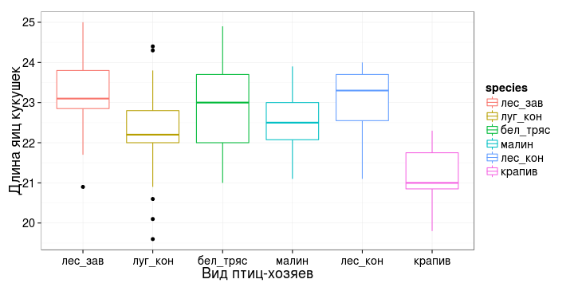
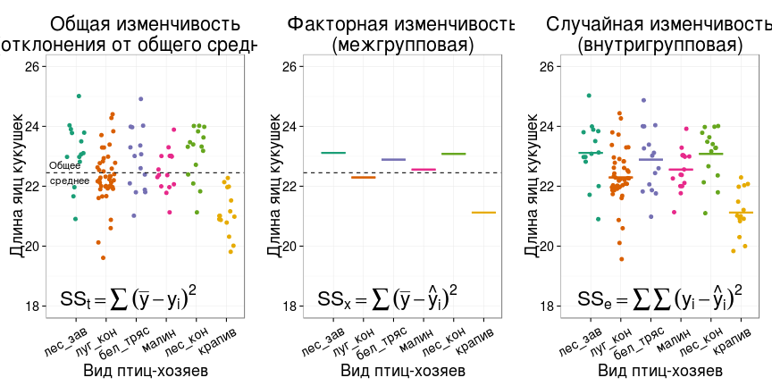
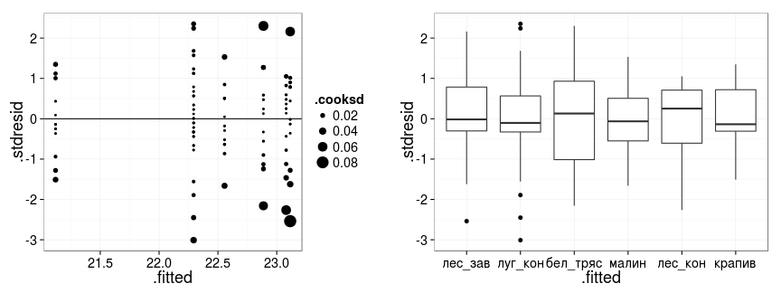
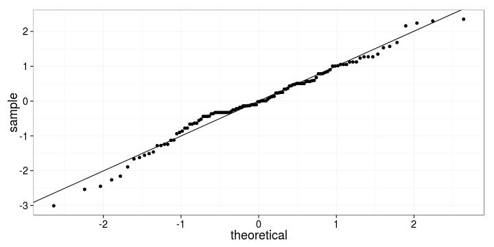
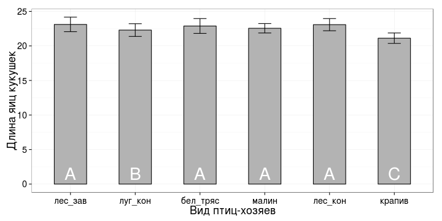
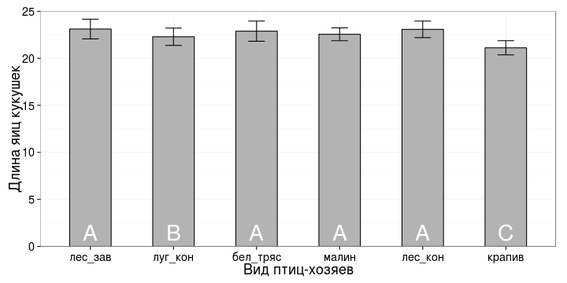
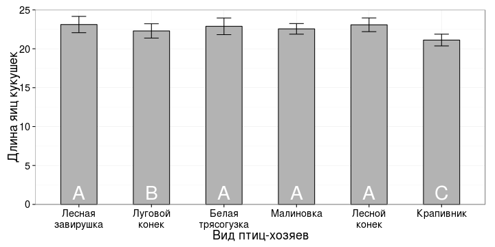

## Дисперсионный анализ

- Модель дисперсионного анализа
- Условия применимости дисперсионного анализа
- Множественные сравнения при дисперсионном анализе (Post hoc тесты)
- Представление результатов дисперсионного анализа

## Вы сможете

- Рассказать, как в дисперсионном анализе моделируются значения зависимой переменной
- Перечислить и проверить условия применимости дисперсионного анализа
- Интерпретировать и описать результаты, записанные в таблице дисперсионного анализа
- Объяснить, в чем опасности множественных сравнений, и как с ними можно бороться
- Провести множественные попарные сравнения при помощи post hoc теста Тьюки, представить и описать их результаты

--- &twocol

## Пример: яйца кукушек


```r
library(DAAG)
data(cuckoos)
levels(cuckoos$species) <- c("лес_зав", "луг_кон", "бел_тряс", "малин", "лес_кон", "крапив")
str(cuckoos)
```

*** =left


```
# 'data.frame':	120 obs. of  4 variables:
#  $ length : num  21.7 22.6 20.9 2..
#  $ breadth: num  16.1 17 16.2 16...
#  $ species: Factor w/ 6 levels ""..
#  $ id     : num  21 22 23 24 25 2..
```

*** =right

Фактор:

- `species`  - вид птиц-хозяев

Зависимая переменная:

- `length` - длина яиц кукушек в гнездах хозяев

<div class = "footnote">Данные: Latter, 1902; источник: Tippett, 1931 </div>

--- .prompt

## Задание: Постройте график

Постройте график зависимости размера яиц кукушек от вида птиц-хозяев, в гнездах которых были обнаружены яйца. Какой геом лучше подойдет для изображения (`geom_point`, `geom_boxplot`)?

Раскрасьте график в зависимости от вида птиц-хозяев (используйте эстетики `fill` или `colour` - чем отличаются результаты?)

### Дополнительное задание:

Попробуйте сменить палитру раскраски, используя `scale_colour_brewer` (варианты можно посмотреть в справке в подразделе примеров или в интернете [Colors (ggplot2): раздел RColorBrewer palette chart](http://www.cookbook-r.com/Graphs/Colors_(ggplot2\)/#palettes-color-brewer ))

---

## Решение


```r
library(ggplot2)
update_geom_defaults("point", list(shape = 19)) 
theme_set(theme_bw(base_size = 18) + 
            theme(legend.key = element_blank()))
gg_cuckoos <- ggplot(data = cuckoos, aes(x = species, y = length, colour = species)) + 
  labs(x = "Вид птиц-хозяев", y = "Длина яиц кукушек") + 
  scale_fill_brewer("Длина яиц кукушек", palette = "Dark2")
gg_cuckoos + geom_boxplot()
```



--- .segue

# Дисперсионный анализ - это линейная модель, ее коэффициенты позволяют сравнить группы

--- .prompt

## Вопрос:

В каком виде включаются дискретные предикторы в линейную модель?

<br/>

> - Сколько фиктивных переменных нужно, чтобы записать модель зависимости длины яиц кукушек от вида птиц-хозяев?

---

## Ответ:

### В каком виде включаются дискретные предикторы в линейную модель?
- В виде фиктивных переменных (Dummy variables)

### Сколько фиктивных переменных нужно, чтобы записать модель зависимости длины яиц кукушек от вида птиц-хозяев?
- 5 фиктивных переменных (т.к. 6 уровней у фактора species - `levels(cuckoos$species)`, один из них будет базовым)


```r
(gr1 <- as.numeric(cuckoos$species == "лес_зав"))
```

```
#   [1] 0 0 0 0 0 0 0 0 0 0 0 0 0 0 0 0 0 0 0 0 0 0 0 0 0 0 0 0 0 0 0 0
#  [33] 0 0 0 0 0 0 0 0 0 0 0 0 0 0 0 0 0 0 0 0 0 0 0 0 0 0 0 0 1 1 1 1
#  [65] 1 1 1 1 1 1 1 1 1 1 0 0 0 0 0 0 0 0 0 0 0 0 0 0 0 0 0 0 0 0 0 0
#  [97] 0 0 0 0 0 0 0 0 0 0 0 0 0 0 0 0 0 0 0 0 0 0 0 0
```

```r
gr2 <- as.numeric(sleep$Danger == "луг_кон")
gr3 <- as.numeric(sleep$Danger == "бел_тряс")
gr4 <- as.numeric(sleep$Danger == "малин")
gr5 <- as.numeric(sleep$Danger == "лес_кон")
gr6 <- as.numeric(sleep$Danger == "крапив")
```

--- &twocol

## Модель записанная с помощью фиктивных переменных

Традиционная параметризация для регрессионного анализа (Dummy (Indicator) Coding = treatment parametrization = reference cell model = `contr.treatment` используется по умолчанию в R)

$$length = \eta _0 + \eta _2 gr _2 + ... + \eta _5 gr _5 + \epsilon$$

*** =left

### Средние в группах по фактору

$\eta _0$ - intercept - среднее значение $y$ на базовом уровне

- для лесных завирушек $\mu _{gr1} = \eta _0$
- для луговых коньков $\mu _{gr2} = \eta _0 + \eta _1$
- для белых трясогузок $\mu _{gr3} = \eta _0 + \eta _2$
- ...
- для крапивников $\mu _{gr6} = \eta _0 + \eta _5$

*** =right

### Интерпретация коэффициентов

Коэффициенты модели - это отклонения среднего значения $y$ в группе от среднего $y$ на базовом уровне

- $\beta _0$ :  $\mu _{gr2} - \mu _{gr1} = (\eta _0 + \eta _1) - \eta _0 = \eta _1$
- $\beta _2$ : $\mu _{gr3} - \mu _{gr1} = (\eta _0 + \eta _2) - \eta _0 = \eta _2$
- ...
- ...
- $\beta _5$ : $\mu _{gr5} - \mu _{gr1} = (\eta _0 + \eta _5) - \eta _0 = \eta _5$

--- .prompt

## Задание: 

Подберите линейную модель зависимости длины яиц кукушек в гнездах от вида птиц-хозяев

Что значат коэффициенты этой линейной модели?

>- Помните ли вы, как изменить уровень, который считается базовым?

---

## Решение

Коэффициенты линейной модели обозначают отклонения от базового уровня (от размера яиц в гнездах у лесной завирушки, см. `levels(cuckoos$species)`)


```r
mod <- lm(length ~ species, data=cuckoos)
summary(mod)
```

```
# 
# Call:
# lm(formula = length ~ species, data = cuckoos)
# 
# Residuals:
#     Min      1Q  Median      3Q     Max 
# -2.6933 -0.3933 -0.0143  0.5083  2.1067 
# 
# Coefficients:
#                 Estimate Std. Error t value    Pr(>|t|)    
# (Intercept)      23.1143     0.2419   95.54     < 2e-16 ***
# speciesлуг_кон   -0.8210     0.2770   -2.96      0.0037 ** 
# speciesбел_тряс  -0.2276     0.3364   -0.68      0.5000    
# speciesмалин     -0.5580     0.3313   -1.68      0.0948 .  
# speciesлес_кон   -0.0343     0.3364   -0.10      0.9190    
# speciesкрапив    -1.9943     0.3364   -5.93 0.000000033 ***
# ---
# Signif. codes:  0 '***' 0.001 '**' 0.01 '*' 0.05 '.' 0.1 ' ' 1
# 
# Residual standard error: 0.905 on 114 degrees of freedom
# Multiple R-squared:  0.314,	Adjusted R-squared:  0.284 
# F-statistic: 10.4 on 5 and 114 DF,  p-value: 0.0000000285
```

--- &twocol

## Модель эффектов

Более традиционная параметризация для дисперсионного анализа (Deviation (Effects) Coding = Sum to zero parametrization = `contr.sum` в R)

$$length = \eta _0 + \eta _1 gr _1 + \eta _2 gr _2 + ... + \eta _5 gr _5 + \epsilon$$

*** =left

### Средние в группах по фактору

- для лесных завирушек $\mu _{gr1} = \eta _0 + \eta _1$
- для луговых коньков $\mu _{gr2} = \eta _0 + \eta _2$
- для белых трясогузок $\mu _{gr3} = \eta _0 + \eta _3$
- ...
- для крапивников<br />$\mu _{gr6} = \eta _0 - \eta _1 - \eta _2 - \eta _3 -\eta _4 - \eta _5$

*** =right

### Интерпретация коэффициентов

$\mu_{gr1} + \mu_{gr2} + ... + \mu_{gr6} = (\eta _0 + \eta _1) + (\eta _0 + \eta _2) +$<br/>
$... + (\eta _0 - \eta _1 - \eta _2 - \eta _3 -\eta _4 - \eta _5) = 6\eta_0$

т.е.

- $\eta _0 = \frac{\mu_{gr1} + \mu_{gr2} + ... + \mu_{gr6}} {3}$ - это intercept, среднее значение всех данных
- $\eta _1$ : $\mu - \mu _{gr1}$
- $\eta _2$ : $\mu - \mu _{gr2}$
- $\eta _3$ : $\mu - \mu _{gr3}$
- $\eta _4$ : $\mu - \mu _{gr4}$
- $\eta _5$ : $\mu - \mu _{gr5}$

---

## Параметризация эффектов в R

Коэффициенты линейной модели обозначают отклонения от общего среднего (ожидаемый средний размер яиц кукушек)


```r
# options('contrasts')
options(contrasts = rep("contr.sum", 2))
mod1 <- lm(length ~ species, data=cuckoos)
summary(mod1)
```

```
# 
# Call:
# lm(formula = length ~ species, data = cuckoos)
# 
# Residuals:
#     Min      1Q  Median      3Q     Max 
# -2.6933 -0.3933 -0.0143  0.5083  2.1067 
# 
# Coefficients:
#             Estimate Std. Error t value Pr(>|t|)    
# (Intercept)  22.5084     0.0900  250.00   <2e-16 ***
# species1      0.6059     0.2171    2.79   0.0062 ** 
# species2     -0.2151     0.1423   -1.51   0.1334    
# species3      0.3782     0.2110    1.79   0.0757 .  
# species4      0.0478     0.2055    0.23   0.8164    
# species5      0.5716     0.2110    2.71   0.0078 ** 
# ---
# Signif. codes:  0 '***' 0.001 '**' 0.01 '*' 0.05 '.' 0.1 ' ' 1
# 
# Residual standard error: 0.905 on 114 degrees of freedom
# Multiple R-squared:  0.314,	Adjusted R-squared:  0.284 
# F-statistic: 10.4 on 5 and 114 DF,  p-value: 0.0000000285
```

---

## Краткая запись модели дисперсионного анализа

$$y _{ij} = \mu + a _i + \epsilon _{ij}$$

Из чего складывется значение _j_-того наблюдения в _i_-той группе по фактору? Из общего среднего, эффекта фактора для данной группы и случайной ошибки.

Группа | Общее среднее | Эффект | <small>Случайная изменчивость</small>
----- | ----- | ----- | -----
очень низкий | $$\mu$$ | $$a _1$$ | $$\epsilon _{1j}$$
низкий | $$\mu$$ | $$a _2$$ | $$\epsilon _{2j}$$
... | ... | ... | ...
очень высокий | $$\mu$$ | $$a _5$$ | $$\epsilon _{5j}$$

--- .segue

# Собственно дисперсионный анализ: влияет ли фактор целиком

---

## Структура общей изменчивости

Общую изменчивость значений зависимой переменной можно разложить:  
Общая изменчивость (SSt) = Факторная (SSx) + Случайная (SSe)


```
# Loading required package: grid
```



Если выборки из одной совокупности, то  
Факторная изменчивость = Случайная изменчивость

--- 

## Таблица однофакторного дисперсионного анализа

Источник изменчивости  |  Суммы квадратов отклонений,<br /><br /> SS   |   Число степеней свободы,<br /><br /> df   | Средний квадрат отклонений<br />(дисперсия),<br /> MS | <br /><br /><br /> F  
---------------------- | --------- | ------ | ------------------- | -----
Название фактора | $$SS _x = \sum{(\bar y - \hat y _i)^2}$$ | $$df _x = a - 1$$ | $$MS _x = \frac{SS _x}{df _x}$$ | $$F _{df _x, df _e} = \frac{MS _x}{MS _e}$$
Случайная | $$SS _e = \sum{(y _i - \hat y _i)^2}$$ | $$df _e = N - a$$ | $$MS _e = \frac{SS _e}{df _e}$$ | 
Общая | $$SS _t = \sum {(\bar y - y _i)^2}$$ | $$df _t = N - 1$$ | 

<br />
Гипотезы:

$H _0: MS _x = MS _e$, $H _A: MS _x ≠ MS _e$

---

## Дисперсионный анализ в R и описание результатов

Anova(результат_функции_lm) - дисперсионный анализ


```r
library(car)
```

```
# 
# Attaching package: 'car'
# 
# The following object is masked from 'package:DAAG':
# 
#     vif
```

```r
cuckoos_anova <- Anova(mod)
cuckoos_anova
```

```
# Anova Table (Type II tests)
# 
# Response: length
#           Sum Sq  Df F value      Pr(>F)    
# species     42.8   5    10.4 0.000000029 ***
# Residuals   93.4 114                        
# ---
# Signif. codes:  0 '***' 0.001 '**' 0.01 '*' 0.05 '.' 0.1 ' ' 1
```


<br />
>- Длина яиц кукушек в гнездах разных птиц-хозяев достоверно различается ($F _{5,114} = 10.45$, \$p < 0.01\$).

--- .prompt

## Вопрос: 

Назовите условия применимости дисперсионного анализа

>- Подсказка: дисперсионный анализ - линейная модель, как и регрессия

--- 

## Ответ:

### Условия примененимости дисперсионного анализа:

- Случайность и независимость групп и наблюдений внутри групп
- Нормальное распределение остатков
- Гомогенность дисперсий остатков

### Другие ограничения:

- Лучше работает, если размеры групп примерно одинаковы (т.наз. сбалансированный дисперсионный комплекс)
- Устойчив к отклонениям от нормального распределения (при равных объемах групп или при больших выборках)

--- .prompt

## Задание: Проверьте условия применимости

Проверьте условия применимости дисперсионного анализа используя графики остатков


---

## Решение


## 1. Данные для проверки условий применимости на графиках остатков


```r
# Данные для анализа остатков
cuckoos_diag <- fortify(mod)
head(cuckoos_diag)
```

```
#   length species   .hat .sigma   .cooksd .fitted  .resid .stdresid
# 1   21.7 луг_кон 0.0222  0.907 0.0016644    22.3 -0.5933    -0.663
# 2   22.6 луг_кон 0.0222  0.909 0.0004446    22.3  0.3067     0.343
# 3   20.9 луг_кон 0.0222  0.899 0.0091786    22.3 -1.3933    -1.557
# 4   21.6 луг_кон 0.0222  0.907 0.0022728    22.3 -0.6933    -0.775
# 5   22.2 луг_кон 0.0222  0.909 0.0000412    22.3 -0.0933    -0.104
# 6   22.5 луг_кон 0.0222  0.909 0.0002019    22.3  0.2067     0.231
```

---

## 2. Выбросы, гомогенность дисперсий

Гомогенность дисперсий в группах можно проверить построив бокс-плот


```r
gg_resid <- ggplot(cuckoos_diag, aes(x = .fitted, y = .stdresid)) 
gg_res_points <- gg_resid + geom_point(aes(size = .cooksd)) + geom_hline(yintercept = 0)
gg_res_box <- gg_resid + geom_boxplot(aes(x = species))
library(gridExtra)
grid.arrange(gg_res_points, gg_res_box, ncol = 2)
```



>- Большинство остатков в пределах двух стандартных отклонений, кроме нескольких значений, которые лежат в пределах трех квадратных отклонений, и мало влияют на ход регрессии судя по расстоянию Кука. Дисперсии в группах приблизительно равны.

---

## 3. Нормальность распределения


```r
ggplot(cuckoos_diag) + geom_point(stat = "qq", aes(sample = .stdresid)) + 
  geom_abline(yintercept = 0, slope = sd(cuckoos_diag$.stdresid))
```



```r
# или 
# qqPlot(mod)
```

>- Распределение практически нормальное

--- .segue

# Теперь хотим узнать, какие именно группы различаются

## Мы узнали, что фактор влияет, т.е. какие-то пары средних различаются

--- &twocol

## Опасности множественных сравнений

### 2 группы - 1 сравнение

$\alpha _{для\ сравнения} = 0.05$

### 6 групп - 15 сравнений

$\alpha _{для\ сравнения} = 0.05$

### А для группы из 15 сравнений?

>- $\alpha _{для\ группы\ сравнений} = 0.05 \cdot 15 = 0.75$
- Опасно! Случайно найдем различия там, где их нет!
- Если много сравнений - нужно вносить поправку!  

---

## Post-hoc тесты

Пост-хок тесты - попарные сравнения средних после того, как дисперсионный анализ показал, что влияние фактора достоверно

### Свойства post-hoc тестов:

- Применяются, __только если влияние фактора значимо__
- Делают поправку для снижения вероятности ошибки I рода $\alpha$, (но не слишком, чтобы не
снизилась мощность, чтобы не возросла $\beta$)
  - Учитывают величину различий между средними
  - Учитывают количество сравниваемых пар
- Различаются по степени консервативности (тест Тьюки - разумный компромисс) 
- Работают лучше при равных объемах групп, при гомогенности дисперсий

---

## Пост-хок тест Тьюки в R

- `glht()` - "general linear hypotheses testing"
- `linfct` - гипотеза для тестирования
- `mcp()` - функция, чтобы задать множественные сравнения (обычные пост-хоки)
- `species` = "Tukey" - тест Тьюки по фактору `species`


```r
library(multcomp)
```

```
# Loading required package: mvtnorm
# Loading required package: survival
# Loading required package: splines
# 
# Attaching package: 'survival'
# 
# The following object is masked from 'package:DAAG':
# 
#     lung
# 
# Loading required package: TH.data
```

```r
cuckoos_pht <- glht(mod, linfct = mcp(species = "Tukey"))
```

---

## Результаты попарных сравнений (тест Тьюки)


```r
summary(cuckoos_pht)
```

```
# 
# 	 Simultaneous Tests for General Linear Hypotheses
# 
# Multiple Comparisons of Means: Tukey Contrasts
# 
# 
# Fit: lm(formula = length ~ species, data = cuckoos)
# 
# Linear Hypotheses:
#                         Estimate Std. Error t value Pr(>|t|)    
# луг_кон - лес_зав == 0   -0.8210     0.2770   -2.96    0.041 *  
# бел_тряс - лес_зав == 0  -0.2276     0.3364   -0.68    0.984    
# малин - лес_зав == 0     -0.5580     0.3313   -1.68    0.538    
# лес_кон - лес_зав == 0   -0.0343     0.3364   -0.10    1.000    
# крапив - лес_зав == 0    -1.9943     0.3364   -5.93   <0.001 ***
# бел_тряс - луг_кон == 0   0.5933     0.2699    2.20    0.241    
# малин - луг_кон == 0      0.2629     0.2635    1.00    0.915    
# лес_кон - луг_кон == 0    0.7867     0.2699    2.91    0.047 *  
# крапив - луг_кон == 0    -1.1733     0.2699   -4.35   <0.001 ***
# малин - бел_тряс == 0    -0.3304     0.3253   -1.02    0.909    
# лес_кон - бел_тряс == 0   0.1933     0.3305    0.58    0.992    
# крапив - бел_тряс == 0   -1.7667     0.3305   -5.34   <0.001 ***
# лес_кон - малин == 0      0.5238     0.3253    1.61    0.587    
# крапив - малин == 0      -1.4363     0.3253   -4.41   <0.001 ***
# крапив - лес_кон == 0    -1.9600     0.3305   -5.93   <0.001 ***
# ---
# Signif. codes:  0 '***' 0.001 '**' 0.01 '*' 0.05 '.' 0.1 ' ' 1
# (Adjusted p values reported -- single-step method)
```

> - Размер яиц кукушек в гнездах крапивника достоверно меньше, чем в гнездах лугового конька (тест Тьюки, $p < 0.01$). Размер яиц кукушек в гнездах лесной завирушки, белой трясогузки, малиновки и лесного конька не различается, но яйца в гнездах этих видов крупнее, чем у лугового конька или крапивника (тест Тьюки, от $p < 0.01$ до 0.05).

--- .segue

# Представление значений в группах

--- &twocol

## Таблица с описательной статистикой по группам 

Пакет `dplyr`:
- `%>%` оператор, перенаправляет значение слева в функцию справа в качестве исходных данных
- `group_by` дальнейшие вычисления идут по группам, заданным ее аргументами
- `summarise` описывает группу строк значениями, вычисленным по формуле или нескольким

*** =left

### Код с `dplyr` 


```r
library(dplyr)
```

```
# 
# Attaching package: 'dplyr'
# 
# The following objects are masked from 'package:stats':
# 
#     filter, lag
# 
# The following objects are masked from 'package:base':
# 
#     intersect, setdiff, setequal, union
```

```r
cuckoos_summary <- cuckoos %>% 
  group_by(species) %>%
  summarise(n = n(),
            mean = mean(length), 
            variance = var(length),
            sd = sd(length))
cuckoos_summary
```

```
# Source: local data frame [6 x 5]
# 
#    species  n mean variance    sd
# 1  лес_зав 14 23.1    1.101 1.049
# 2  луг_кон 45 22.3    0.846 0.920
# 3 бел_тряс 15 22.9    1.150 1.072
# 4    малин 16 22.6    0.465 0.682
# 5  лес_кон 15 23.1    0.775 0.880
# 6   крапив 15 21.1    0.569 0.754
```

*** =right

### Код только с базовыми функциями


```r
aggregate(length ~ species, data = cuckoos, 
          FUN = function(x) {
            c(n = length(x), mean=mean(x), 
              variance = var(x), sd=sd(x))
            }
          )
```

```
#    species length.n length.mean length.variance length.sd
# 1  лес_зав   14.000      23.114           1.101     1.049
# 2  луг_кон   45.000      22.293           0.846     0.920
# 3 бел_тряс   15.000      22.887           1.150     1.072
# 4    малин   16.000      22.556           0.465     0.682
# 5  лес_кон   15.000      23.080           0.775     0.880
# 6   крапив   15.000      21.120           0.569     0.754
```


---

## Столбчатый график можно использовать для представления результатов


```r
gg_means <- ggplot(cuckoos_summary, aes(x = species, y = mean)) + 
  geom_bar(stat = "identity", fill = "gray70", colour = "black", width = 0.5) + 
  geom_errorbar(aes(ymin = mean - sd, ymax = mean + sd), width = 0.2) +
  labs(x = "Вид птиц-хозяев", y = "Длина яиц кукушек")
gg_means
```


---

## Можно привести результаты пост-хок теста на столбчатом графике

Достоверно различающиеся по пост-хок тесту группы обозначим разными буквами


```r
gg_means_coded <- gg_means + 
  geom_text(aes(y = 1.5,  label = c("A", "B", "A", "A", "A", "C")), colour = "white", size = 10)
gg_means_coded
```



---

## Если не нравится, как висят столбцы,<br />можно настроить развертку оси $y$


```r
gg_means_coded + scale_y_continuous(expand = c(0,0), limits = c(0, 25))
```



---

## И наконец, можно переименовать уровни фактора species прямо внутри графика

`\n` - символ конца строки


```r
gg_means_coded + scale_y_continuous(expand = c(0,0), limits = c(0, 25)) +
  scale_x_discrete(labels = c("Лесная\nзавирушка", "Луговой\nконек", "Белая\nтрясогузка", 
                            "Малиновка", "Лесной\nконек", "Крапивник"))
```




---

## Сохраняем таблицу дисперсионного анализа в файл


```r
# в csv
write.table(file = "cuckoos_res.csv", x = cuckoos_anova, sep = "\t")

# в xls или xlsx с помощью XLConnect
# library(XLConnect)
# writeWorksheetToFile(data = cuckoos_anova, file = "cuckoos_res.xls", sheet = "anova_table")

# или

# отправляем в буфер обмена (только Windows) для вставки в Word-Excel
write.table(file = "clipboard", x = cuckoos_anova, sep = "\t")
```

После этого, таблицу нужно отредактировать:
- округлить числа, оставив разумное небольшое число значащих цифр после точки
- округлить значения доверительных вероятностей p или заменить их на сравнения с критич. уровнями значимости (p < 0.01, p < 0.05 или "не значимо")
- изменить названия факторов на те, которые будут использоваться в отчете/публикации

---

## Take home messages

- Дисперсионный анализ - линейная модель с дискретными предикторами, существует в нескольких параметризациях, которые отличаются трактовками коэффициентов
- При помощи дисперсионного анализа можно проверить гипотезу о равенстве средних значений в группах
- Условия применимости дисперсионного анализа
  - Случайность и независимость групп и наблюдений внутри групп
  - Нормальное распределение в группах
  - Гомогенность дисперсий в группах
- При множественных попарных сравнениях увеличивается вероятность ошибки первого рода, поэтому нужно вносить поправку для уровня значимости
- Post hoc тесты - это попарные сравнения после дисперсионного анализа, которые позволяют сказать, какие именно средние различаются

---

## Дополнительные ресурсы

- Quinn, Keough, 2002, pp. 173-207
- Logan, 2010, pp. 254 - 282
- [Open Intro to Statistics](http://www.openintro.org/stat/), pp.236-246 
- Sokal, Rohlf, 1995, pp. 179-260
- Zar, 2010, pp. 189-207
